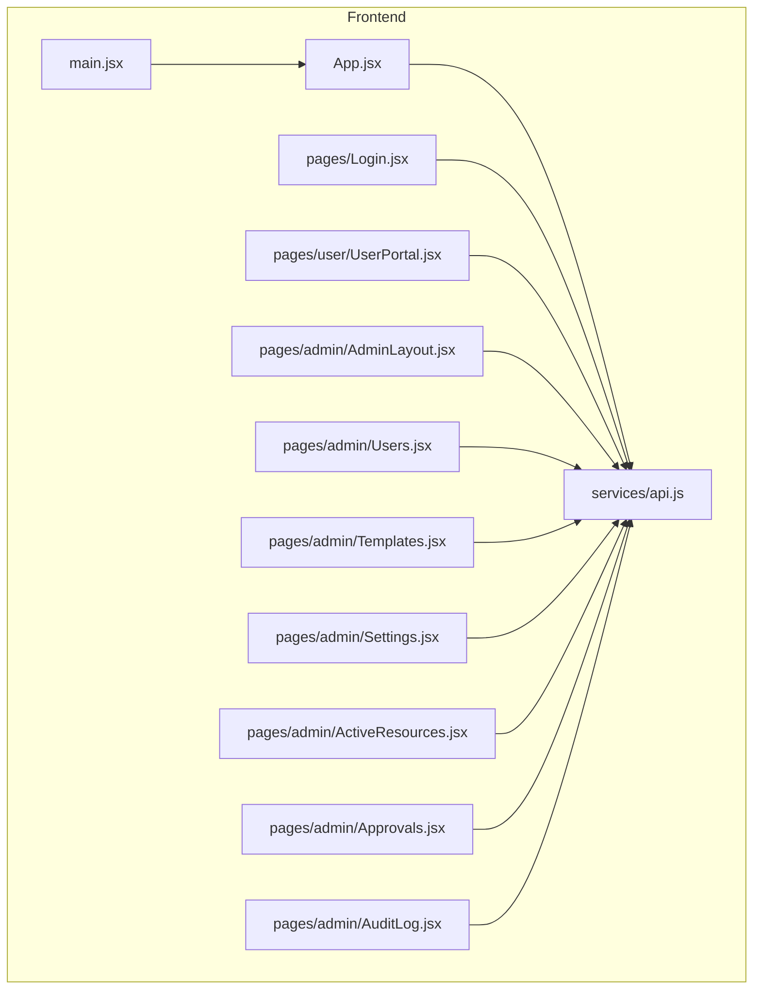
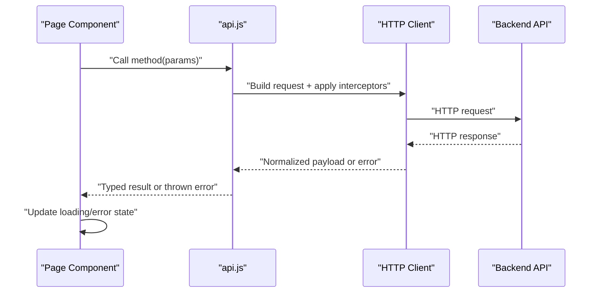
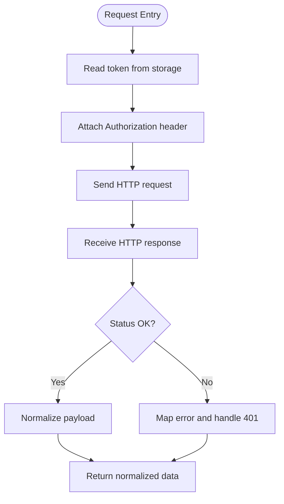
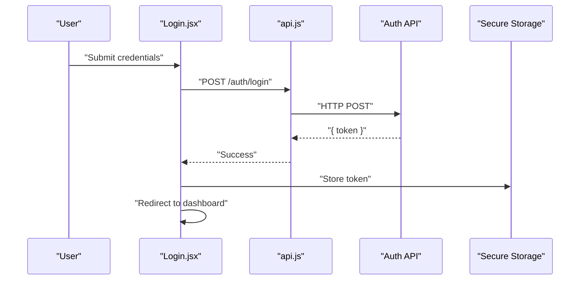
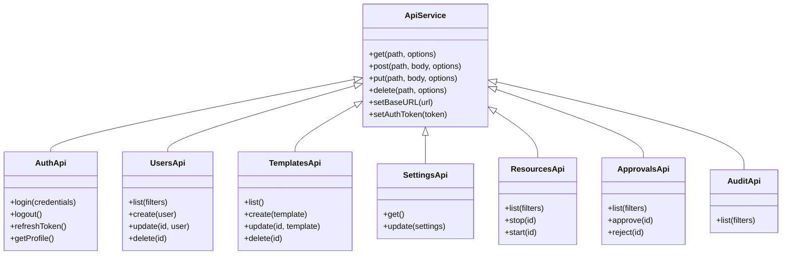
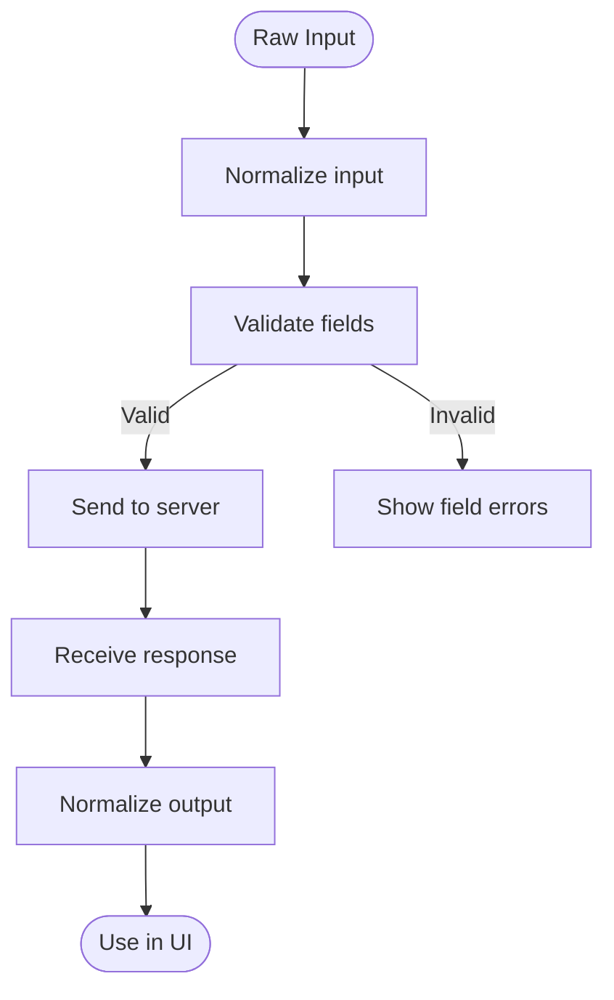
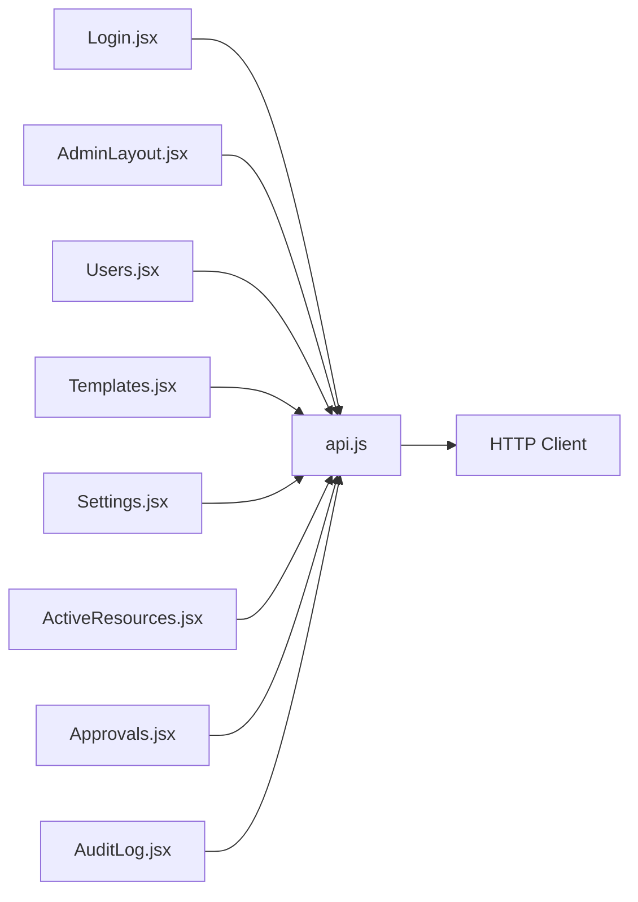

# API Integration & Service Layer

<cite>
**Referenced Files in This Document**
- [api.js](file://frontend/src/services/api.js)
- [main.jsx](file://frontend/src/main.jsx)
- [App.jsx](file://frontend/src/App.jsx)
- [Login.jsx](file://frontend/src/pages/Login.jsx)
- [UserPortal.jsx](file://frontend/src/pages/user/UserPortal.jsx)
- [AdminLayout.jsx](file://frontend/src/pages/admin/AdminLayout.jsx)
- [Users.jsx](file://frontend/src/pages/admin/Users.jsx)
- [Templates.jsx](file://frontend/src/pages/admin/Templates.jsx)
- [Settings.jsx](file://frontend/src/pages/admin/Settings.jsx)
- [ActiveResources.jsx](file://frontend/src/pages/admin/ActiveResources.jsx)
- [Approvals.jsx](file://frontend/src/pages/admin/Approvals.jsx)
- [AuditLog.jsx](file://frontend/src/pages/admin/AuditLog.jsx)
</cite>

## Table of Contents
1. [Introduction](#introduction)
2. [Project Structure](#project-structure)
3. [Core Components](#core-components)
4. [Architecture Overview](#architecture-overview)
5. [Detailed Component Analysis](#detailed-component-analysis)
6. [Dependency Analysis](#dependency-analysis)
7. [Performance Considerations](#performance-considerations)
8. [Troubleshooting Guide](#troubleshooting-guide)
9. [Conclusion](#conclusion)
10. [Appendices](#appendices)

## Introduction
This document explains the frontend API integration layer with a focus on the api.js service implementation and how it is consumed across pages. It covers HTTP client configuration, request/response interceptors, error handling strategies, authentication token management, service abstraction patterns, endpoint organization, data transformation layers, loading states, error boundaries, retry logic, caching, request deduplication, and performance optimization techniques. The goal is to provide both conceptual guidance and concrete references to the codebase for consistent, maintainable API usage.

## Project Structure
The frontend organizes API-related concerns under services and consumes them from page components:
- Services: centralized HTTP client and API abstractions
- Pages: feature modules that call service methods and manage UI state (loading, errors)
- App entry points: bootstrap application and routing

**Diagram sources**
- [App.jsx](file://frontend/src/App.jsx)
- [main.jsx](file://frontend/src/main.jsx)
- [api.js](file://frontend/src/services/api.js)
- [Login.jsx](file://frontend/src/pages/Login.jsx)
- [UserPortal.jsx](file://frontend/src/pages/user/UserPortal.jsx)
- [AdminLayout.jsx](file://frontend/src/pages/admin/AdminLayout.jsx)
- [Users.jsx](file://frontend/src/pages/admin/Users.jsx)
- [Templates.jsx](file://frontend/src/pages/admin/Templates.jsx)
- [Settings.jsx](file://frontend/src/pages/admin/Settings.jsx)
- [ActiveResources.jsx](file://frontend/src/pages/admin/ActiveResources.jsx)
- [Approvals.jsx](file://frontend/src/pages/admin/Approvals.jsx)
- [AuditLog.jsx](file://frontend/src/pages/admin/AuditLog.jsx)

**Section sources**
- [main.jsx](file://frontend/src/main.jsx)
- [App.jsx](file://frontend/src/App.jsx)
- [api.js](file://frontend/src/services/api.js)

## Core Components
- HTTP Client Configuration
  - Base URL and default headers are configured centrally in the service file.
  - Interceptors attach authentication tokens to outgoing requests and normalize responses.
- Request/Response Interceptors
  - Request interceptor injects Authorization header using stored tokens.
  - Response interceptor transforms payloads and centralizes error mapping.
- Error Handling Strategy
  - Network vs server errors are distinguished.
  - Unauthorized responses trigger token refresh or logout flows.
  - User-facing messages are surfaced via a consistent error shape.
- Authentication Token Management
  - Tokens are read/written to secure storage (e.g., httpOnly cookies or memory).
  - Refresh flow is triggered automatically on 401 when supported by the backend.
- Service Abstraction Pattern
  - Thin wrappers around HTTP calls encapsulate endpoints, parameters, and transformations.
  - Each domain (auth, users, templates, settings, resources, approvals, audit) has its own module or namespace within the service.
- Endpoint Organization
  - Endpoints are grouped by feature area and exposed as functions with clear signatures.
  - Path constants are centralized to avoid duplication.
- Data Transformation Layers
  - Input normalization before sending (e.g., date formatting).
  - Output normalization after receiving (e.g., snake_case to camelCase).

**Section sources**
- [api.js](file://frontend/src/services/api.js)

## Architecture Overview
The integration layer follows a layered approach:
- Presentation Layer (Pages): Manage UI state and call service methods.
- Service Layer (api.js): Encapsulates HTTP calls, interceptors, and transformations.
- Backend APIs: REST endpoints served by the backend.

**Diagram sources**
- [api.js](file://frontend/src/services/api.js)
- [Login.jsx](file://frontend/src/pages/Login.jsx)
- [Users.jsx](file://frontend/src/pages/admin/Users.jsx)

## Detailed Component Analysis

### HTTP Client Configuration and Interceptors
- Base URL and defaults
  - Centralized base URL ensures consistent routing across environments.
  - Default headers include content type and optional CSRF or locale settings.
- Request Interceptor
  - Reads current token from storage and attaches Authorization header.
  - Adds request IDs for tracing and correlation.
- Response Interceptor
  - Unwraps standardized response envelopes.
  - Maps backend error codes to user-friendly messages.
  - Handles 401 by triggering token refresh or redirecting to login.

**Diagram sources**
- [api.js](file://frontend/src/services/api.js)

**Section sources**
- [api.js](file://frontend/src/services/api.js)

### Authentication Flow and Token Management
- Login
  - Credentials sent to auth endpoint; on success, token stored securely.
  - Redirect to protected route upon successful login.
- Protected Access
  - Interceptors ensure every request includes the token.
  - On 401, attempt silent refresh if supported; otherwise, force logout.
- Logout
  - Clears local token and navigates to login.

**Diagram sources**
- [Login.jsx](file://frontend/src/pages/Login.jsx)
- [api.js](file://frontend/src/services/api.js)

**Section sources**
- [Login.jsx](file://frontend/src/pages/Login.jsx)
- [api.js](file://frontend/src/services/api.js)

### Service Abstraction and Endpoint Organization
- Domain Modules
  - Auth: login, logout, refresh, me/profile.
  - Users: list, create, update, delete.
  - Templates: CRUD operations.
  - Settings: get/update system settings.
  - Resources: active resources listing and lifecycle actions.
  - Approvals: approve/reject workflows.
  - Audit: query logs and filters.
- Method Signatures
  - Consistent function shapes: async methods returning typed results or throwing structured errors.
- Path Constants
  - Centralized path definitions prevent drift between client and server routes.

**Diagram sources**
- [api.js](file://frontend/src/services/api.js)

**Section sources**
- [api.js](file://frontend/src/services/api.js)

### Data Transformation Layers
- Input Normalization
  - Convert dates, enums, and nested objects into server-compatible formats.
- Output Normalization
  - Map snake_case to camelCase, flatten nested structures, and coerce types.
- Validation Helpers
  - Lightweight client-side validation before sending requests to reduce round trips.

**Diagram sources**
- [api.js](file://frontend/src/services/api.js)

**Section sources**
- [api.js](file://frontend/src/services/api.js)

### Usage Examples Across Pages
- Login Page
  - Calls auth login, stores token, redirects on success, shows errors on failure.
- Admin Layout
  - Guards access based on authentication state and token presence.
- Users Page
  - Lists users with pagination and filters; handles loading and error states.
- Templates Page
  - Creates and updates templates; validates inputs before submission.
- Settings Page
  - Fetches and updates global settings; optimistic updates with rollback on error.
- Active Resources Page
  - Polls or subscribes to resource status changes; debounces rapid actions.
- Approvals Page
  - Batch approves/rejects items; shows progress and final summary.
- Audit Log Page
  - Filters and paginates audit entries; supports export.

**Section sources**
- [Login.jsx](file://frontend/src/pages/Login.jsx)
- [AdminLayout.jsx](file://frontend/src/pages/admin/AdminLayout.jsx)
- [Users.jsx](file://frontend/src/pages/admin/Users.jsx)
- [Templates.jsx](file://frontend/src/pages/admin/Templates.jsx)
- [Settings.jsx](file://frontend/src/pages/admin/Settings.jsx)
- [ActiveResources.jsx](file://frontend/src/pages/admin/ActiveResources.jsx)
- [Approvals.jsx](file://frontend/src/pages/admin/Approvals.jsx)
- [AuditLog.jsx](file://frontend/src/pages/admin/AuditLog.jsx)

## Dependency Analysis
The following diagram shows how pages depend on the service layer and how the service depends on the HTTP client.

**Diagram sources**
- [Login.jsx](file://frontend/src/pages/Login.jsx)
- [AdminLayout.jsx](file://frontend/src/pages/admin/AdminLayout.jsx)
- [Users.jsx](file://frontend/src/pages/admin/Users.jsx)
- [Templates.jsx](file://frontend/src/pages/admin/Templates.jsx)
- [Settings.jsx](file://frontend/src/pages/admin/Settings.jsx)
- [ActiveResources.jsx](file://frontend/src/pages/admin/ActiveResources.jsx)
- [Approvals.jsx](file://frontend/src/pages/admin/Approvals.jsx)
- [AuditLog.jsx](file://frontend/src/pages/admin/AuditLog.jsx)
- [api.js](file://frontend/src/services/api.js)

**Section sources**
- [api.js](file://frontend/src/services/api.js)

## Performance Considerations
- Caching Strategies
  - Implement GET request caching with time-based invalidation and cache keys derived from query params.
  - Provide manual invalidation hooks for mutations that affect cached lists.
- Request Deduplication
  - Coalesce identical concurrent requests to the same endpoint and parameters to avoid duplicate network calls.
- Retry Logic
  - Apply exponential backoff with jitter for transient failures (network timeouts, 5xx).
  - Do not retry idempotent requests only; skip retries for non-idempotent writes unless safe.
- Optimistic Updates
  - Update UI immediately for mutations; roll back on failure with precise error mapping.
- Pagination and Virtualization
  - Use cursor-based pagination for large datasets; virtualize long lists to improve rendering performance.
- Debounce and Throttle
  - Debounce search inputs and throttle frequent actions (e.g., polling intervals).
- Prefetching
  - Prefetch likely next-page data or related entities during idle times.

[No sources needed since this section provides general guidance]

## Troubleshooting Guide
- Common Errors
  - Network errors: connectivity issues, CORS misconfiguration, proxy problems.
  - Server errors: 4xx client errors, 5xx server errors, malformed responses.
  - Auth errors: missing/expired tokens, failed refresh, unauthorized access.
- Debugging Tips
  - Enable request logging with sanitized payloads in development.
  - Inspect normalized error shapes and stack traces.
  - Verify base URL and environment variables.
- Recovery Patterns
  - Automatic retry for transient errors with backoff.
  - Graceful fallbacks when offline (queue mutations, show offline banner).
  - Clear stale cache on version mismatch or schema change.

**Section sources**
- [api.js](file://frontend/src/services/api.js)

## Conclusion
The frontend API integration layer centers around a robust service implementation that standardizes HTTP interactions, enforces consistent error handling, and manages authentication seamlessly. By adopting service abstractions, data transformation layers, and performance optimizations such as caching, deduplication, and retries, the application achieves reliability and responsiveness. Pages consume these services through clear method signatures and manage UI state effectively, resulting in a maintainable and scalable architecture.

[No sources needed since this section summarizes without analyzing specific files]

## Appendices

### Example Call Patterns
- Making an authenticated GET request
  - Use the service method for the domain, pass query parameters, and handle loading and error states in the component.
- Performing a mutation with optimistic updates
  - Update local state immediately, send the request, and revert on error with user feedback.
- Handling pagination
  - Pass page and size parameters; append new items to existing lists and disable load-more when exhausted.

[No sources needed since this section provides general guidance]