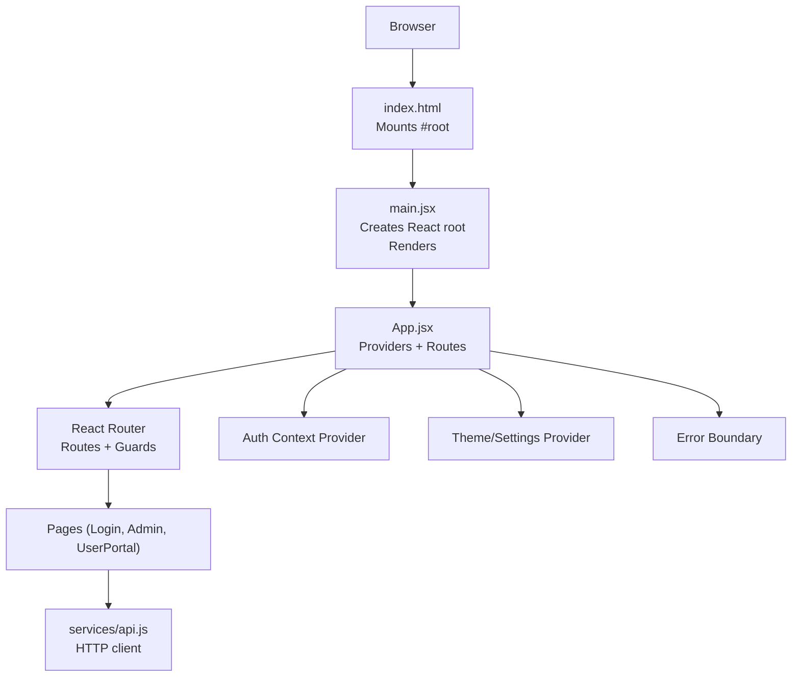
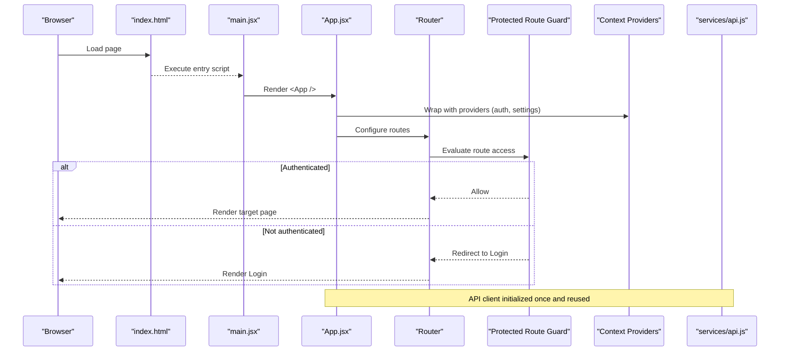
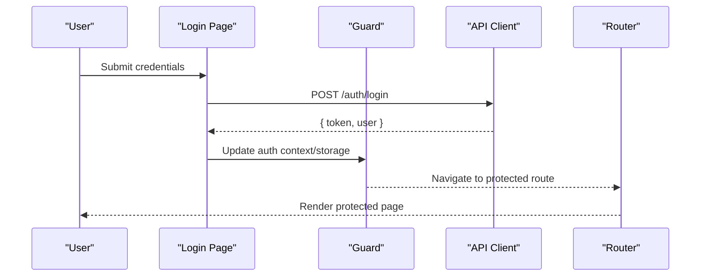
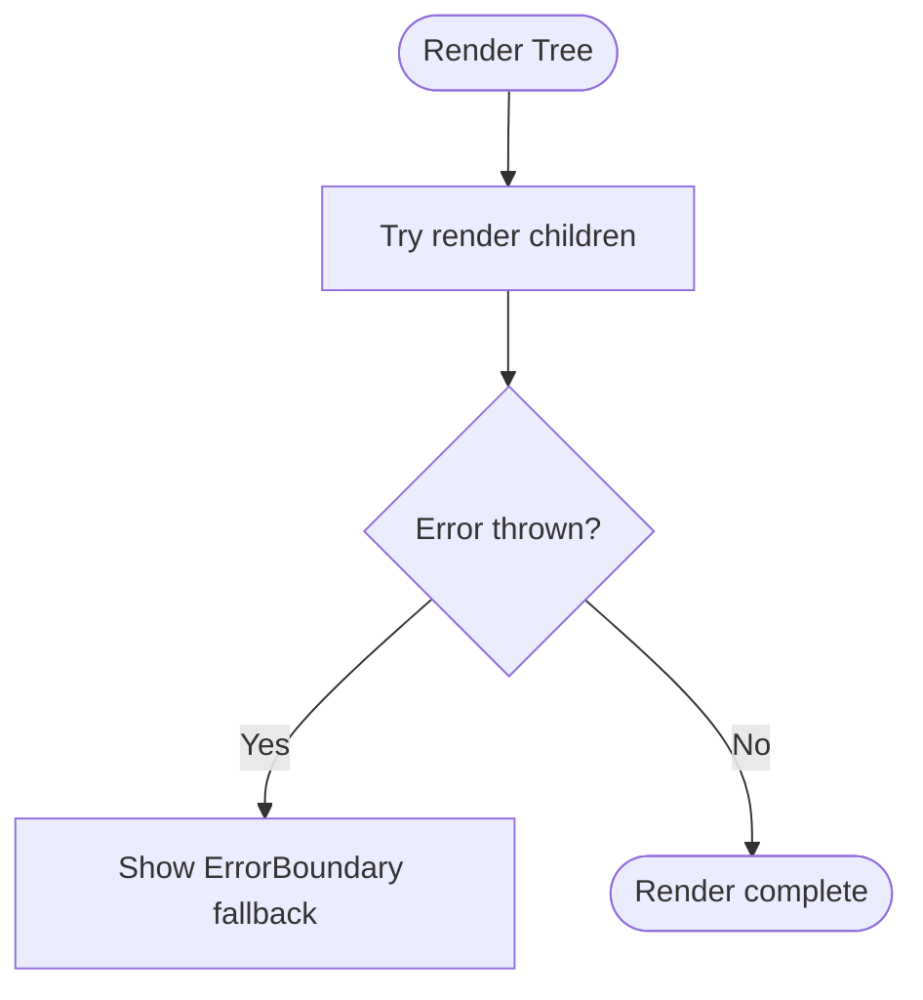
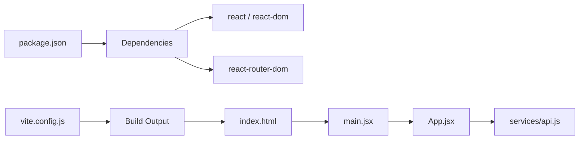

# Application Bootstrap & Entry Points

<cite>
**Referenced Files in This Document**
- [main.jsx](file://frontend/src/main.jsx)
- [App.jsx](file://frontend/src/App.jsx)
- [index.html](file://frontend/index.html)
- [package.json](file://frontend/package.json)
- [vite.config.js](file://frontend/vite.config.js)
- [api.js](file://frontend/src/services/api.js)
</cite>

## Table of Contents
1. [Introduction](#introduction)
2. [Project Structure](#project-structure)
3. [Core Components](#core-components)
4. [Architecture Overview](#architecture-overview)
5. [Detailed Component Analysis](#detailed-component-analysis)
6. [Dependency Analysis](#dependency-analysis)
7. [Performance Considerations](#performance-considerations)
8. [Troubleshooting Guide](#troubleshooting-guide)
9. [Conclusion](#conclusion)
10. [Appendices](#appendices)

## Introduction
This document explains how the React application boots and initializes at runtime, focusing on the entry points, root component setup, routing configuration, authentication guards, context providers, dependency injection patterns, error boundaries, and performance optimizations during startup. It also provides guidance for customizing the bootstrap process and adding global middleware to the client-side flow.

## Project Structure
The frontend is a Vite-based React application. The browser loads index.html, which mounts a root element. The JavaScript entry point main.jsx renders the React tree into that root element. App.jsx defines the top-level layout, routes, and application-wide providers.

**Diagram sources**
- [index.html:1-200](file://frontend/index.html#L1-L200)
- [main.jsx:1-200](file://frontend/src/main.jsx#L1-L200)
- [App.jsx:1-200](file://frontend/src/App.jsx#L1-L200)
- [api.js:1-200](file://frontend/src/services/api.js#L1-L200)

**Section sources**
- [index.html:1-200](file://frontend/index.html#L1-L200)
- [main.jsx:1-200](file://frontend/src/main.jsx#L1-L200)
- [App.jsx:1-200](file://frontend/src/App.jsx#L1-L200)

## Core Components
- main.jsx: Creates the React root, configures any global providers around the root component, and mounts the app into the DOM.
- App.jsx: Defines the application shell, sets up routing, wraps routes with authentication guards and context providers, and may include an error boundary.
- services/api.js: Central HTTP client used by pages and components; often configured with base URL, interceptors, and token handling.

Key responsibilities:
- Initialization order: HTML -> main.jsx -> App.jsx -> Providers/Routes -> Pages
- Global state via contexts (e.g., auth, theme/settings)
- Routing and protected routes
- Dependency injection through context or provider props

**Section sources**
- [main.jsx:1-200](file://frontend/src/main.jsx#L1-L200)
- [App.jsx:1-200](file://frontend/src/App.jsx#L1-L200)
- [api.js:1-200](file://frontend/src/services/api.js#L1-L200)

## Architecture Overview
The bootstrap sequence follows a clear pipeline from static HTML to interactive UI.

**Diagram sources**
- [index.html:1-200](file://frontend/index.html#L1-L200)
- [main.jsx:1-200](file://frontend/src/main.jsx#L1-L200)
- [App.jsx:1-200](file://frontend/src/App.jsx#L1-L200)
- [api.js:1-200](file://frontend/src/services/api.js#L1-L200)

## Detailed Component Analysis

### main.jsx: Root Initialization
Responsibilities typically include:
- Creating the React root container
- Rendering the root component with global providers
- Optionally enabling development tools or strict mode
- Mounting into the DOM element defined in index.html

Customization examples:
- Add a global loading screen while dependencies initialize
- Inject environment-specific providers based on build flags
- Wrap the entire app with a global error boundary

**Section sources**
- [main.jsx:1-200](file://frontend/src/main.jsx#L1-L200)

### App.jsx: Shell, Routing, and Providers
Responsibilities typically include:
- Defining the application layout
- Configuring routes and nested layouts
- Implementing authentication guards for protected routes
- Providing global contexts (auth, settings/theme)
- Optional: wrapping with an error boundary

Routing and guards:
- Public routes: e.g., Login
- Protected routes: require valid session/token
- Redirect logic when unauthenticated

Provider composition:
- Order matters: outer providers can affect inner ones
- Example pattern: ErrorBoundary > SettingsProvider > AuthProvider > Router

**Section sources**
- [App.jsx:1-200](file://frontend/src/App.jsx#L1-L200)

### services/api.js: Client Configuration and Interceptors
Responsibilities typically include:
- Setting base URL and default headers
- Attaching tokens from context or storage
- Handling common errors and retries
- Centralized request/response transformations

Integration with bootstrap:
- Initialize once at app start
- Ensure token availability before making requests
- Provide hooks or utilities for pages to call APIs

**Section sources**
- [api.js:1-200](file://frontend/src/services/api.js#L1-L200)

### Authentication Flow (Sequence)

**Diagram sources**
- [App.jsx:1-200](file://frontend/src/App.jsx#L1-L200)
- [api.js:1-200](file://frontend/src/services/api.js#L1-L200)

### Error Boundary Pattern
Wrap critical sections with an error boundary to catch rendering errors and display a fallback UI. Place it near the root to capture most issues.

[No sources needed since this diagram shows conceptual workflow, not actual code structure]

## Dependency Analysis
Top-level dependencies relevant to bootstrap:
- React and React DOM for rendering
- React Router for navigation and route guards
- Build tooling (Vite) for bundling and dev server

**Diagram sources**
- [package.json:1-200](file://frontend/package.json#L1-L200)
- [vite.config.js:1-200](file://frontend/vite.config.js#L1-L200)
- [index.html:1-200](file://frontend/index.html#L1-L200)
- [main.jsx:1-200](file://frontend/src/main.jsx#L1-L200)
- [App.jsx:1-200](file://frontend/src/App.jsx#L1-L200)
- [api.js:1-200](file://frontend/src/services/api.js#L1-L200)

**Section sources**
- [package.json:1-200](file://frontend/package.json#L1-L200)
- [vite.config.js:1-200](file://frontend/vite.config.js#L1-L200)

## Performance Considerations
- Code splitting: Lazy-load heavy routes and components to reduce initial bundle size.
- Prefetching: Preload critical resources or data for likely next routes.
- Memoization: Use memoization for expensive computations within providers or frequently rendered components.
- Minimize provider re-renders: Keep context values stable and split contexts to avoid unnecessary updates.
- Dev-only features: Disable verbose logging and extra checks in production builds.

[No sources needed since this section provides general guidance]

## Troubleshooting Guide
Common issues and checks:
- Root element missing: Ensure index.html contains the expected mount node and main.jsx targets it.
- Router not working: Verify route definitions and guard logic; confirm redirects are correct.
- Auth not persisting: Check token storage and context initialization order.
- API failures: Inspect base URL, headers, and interceptor behavior in api.js.
- Errors swallowed: Confirm an error boundary is present and displays useful information.

**Section sources**
- [index.html:1-200](file://frontend/index.html#L1-L200)
- [main.jsx:1-200](file://frontend/src/main.jsx#L1-L200)
- [App.jsx:1-200](file://frontend/src/App.jsx#L1-L200)
- [api.js:1-200](file://frontend/src/services/api.js#L1-L200)

## Conclusion
The bootstrap process centers on a small set of files: index.html provides the mount point, main.jsx creates the React root and renders the app shell, and App.jsx wires together providers, routing, and guards. By keeping initialization predictable and modular, you can easily customize the bootstrap flow, add global middleware, and optimize startup performance.

## Appendices

### Customizing the Bootstrap Process
- Add a global preloader in main.jsx until dependencies are ready.
- Introduce a new context provider around the root in main.jsx or App.jsx.
- Register analytics or telemetry early in App.jsx after providers are available.

### Adding Global Middleware (Client-Side)
- Request/response hooks in services/api.js to attach tokens, log requests, or handle errors globally.
- Route-level middleware via a higher-order component or wrapper used by protected routes.
- Global event listeners or service workers registered during bootstrap if applicable.