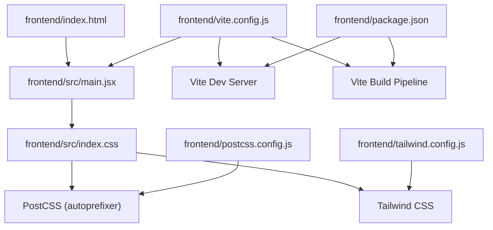
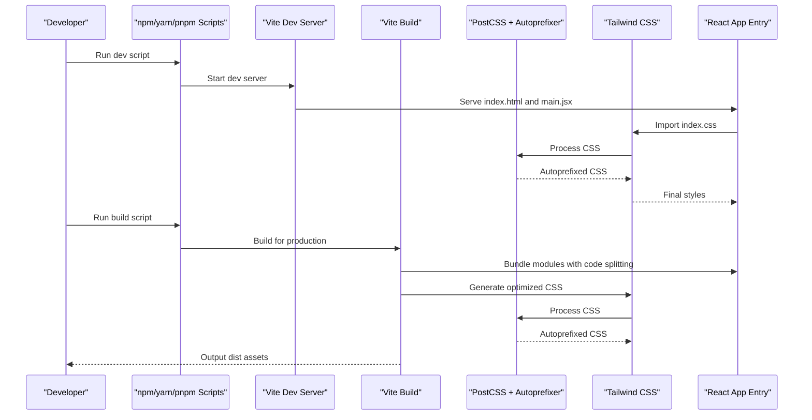
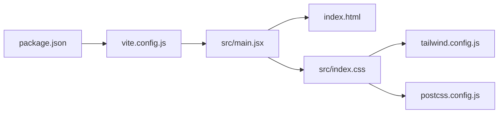

# Build System & Configuration

<cite>
**Referenced Files in This Document**
- [package.json](file://frontend/package.json)
- [vite.config.js](file://frontend/vite.config.js)
- [tailwind.config.js](file://frontend/tailwind.config.js)
- [postcss.config.js](file://frontend/postcss.config.js)
- [index.html](file://frontend/index.html)
- [main.jsx](file://frontend/src/main.jsx)
- [index.css](file://frontend/src/index.css)
</cite>

## Table of Contents
1. [Introduction](#introduction)
2. [Project Structure](#project-structure)
3. [Core Components](#core-components)
4. [Architecture Overview](#architecture-overview)
5. [Detailed Component Analysis](#detailed-component-analysis)
6. [Dependency Analysis](#dependency-analysis)
7. [Performance Considerations](#performance-considerations)
8. [Troubleshooting Guide](#troubleshooting-guide)
9. [Conclusion](#conclusion)
10. [Appendices](#appendices)

## Introduction
This document explains the frontend build system and development environment setup for the project. It focuses on Vite configuration for the development server, build optimization, and code splitting; Tailwind CSS configuration for styling customization, theme setup, and responsive utilities; PostCSS configuration for CSS processing and autoprefixing; and package.json scripts for development, testing, and production builds. It also provides guidance on extending the build pipeline, adding custom plugins, and optimizing bundle size.

## Project Structure
The frontend build configuration is centralized under the frontend directory with the following key files:
- Vite configuration for dev server, build, and plugin integration
- Tailwind CSS configuration for theme and utility customization
- PostCSS configuration for CSS processing and autoprefixer
- Package scripts for running the dev server, building, previewing, and linting
- Application entry points and styles that integrate with the build pipeline

**Diagram sources**
- [index.html](file://frontend/index.html)
- [main.jsx](file://frontend/src/main.jsx)
- [index.css](file://frontend/src/index.css)
- [vite.config.js](file://frontend/vite.config.js)
- [tailwind.config.js](file://frontend/tailwind.config.js)
- [postcss.config.js](file://frontend/postcss.config.js)
- [package.json](file://frontend/package.json)

**Section sources**
- [index.html](file://frontend/index.html)
- [main.jsx](file://frontend/src/main.jsx)
- [index.css](file://frontend/src/index.css)
- [vite.config.js](file://frontend/vite.config.js)
- [tailwind.config.js](file://frontend/tailwind.config.js)
- [postcss.config.js](file://frontend/postcss.config.js)
- [package.json](file://frontend/package.json)

## Core Components
- Vite configuration: Defines the development server options, build targets, output directories, and plugin integrations. It orchestrates the entire build pipeline and controls code splitting behavior via dynamic imports and route-based chunking.
- Tailwind CSS configuration: Customizes theme tokens, extends default utilities, configures content scanning paths, and enables responsive design utilities.
- PostCSS configuration: Integrates Tailwind and autoprefixer to process CSS, normalize vendor prefixes, and ensure cross-browser compatibility.
- Package scripts: Provide commands for starting the dev server, building for production, previewing the production build locally, and running linters or tests as needed.

Key responsibilities:
- Development server hot module replacement (HMR), fast refresh, and local proxy settings if required
- Production build optimizations including minification, tree-shaking, and asset handling
- CSS pipeline integration with Tailwind and PostCSS
- Script-driven workflows for consistent developer experience

**Section sources**
- [vite.config.js](file://frontend/vite.config.js)
- [tailwind.config.js](file://frontend/tailwind.config.js)
- [postcss.config.js](file://frontend/postcss.config.js)
- [package.json](file://frontend/package.json)

## Architecture Overview
The frontend build architecture integrates Vite, Tailwind CSS, and PostCSS into a cohesive pipeline. The HTML entry references the React application entry point, which loads global styles processed by PostCSS and Tailwind. Vite manages both development and production flows, applying code splitting and optimization strategies.

**Diagram sources**
- [package.json](file://frontend/package.json)
- [vite.config.js](file://frontend/vite.config.js)
- [postcss.config.js](file://frontend/postcss.config.js)
- [tailwind.config.js](file://frontend/tailwind.config.js)
- [index.html](file://frontend/index.html)
- [main.jsx](file://frontend/src/main.jsx)
- [index.css](file://frontend/src/index.css)

## Detailed Component Analysis

### Vite Configuration
Vite is configured to provide a fast development experience and an optimized production build. Typical responsibilities include:
- Development server options such as host, port, and HMR behavior
- Build target configuration for modern browsers
- Output directory structure and asset naming strategies
- Plugin integrations for React, CSS processing, and optional features like image optimization
- Code splitting strategy using dynamic imports and route-level chunks

Optimization aspects:
- Tree-shaking and dead code elimination
- Minification for JavaScript and CSS
- Asset inlining vs. externalization based on size thresholds
- Pre-bundling dependencies for faster cold starts

Code splitting patterns:
- Route-based lazy loading to reduce initial bundle size
- Library chunking for shared dependencies
- Vendor chunk separation for long-term caching

**Section sources**
- [vite.config.js](file://frontend/vite.config.js)

### Tailwind CSS Configuration
Tailwind is configured to customize the design system and enable responsive utilities:
- Theme extensions for colors, spacing, typography, and breakpoints
- Content scanning paths to generate only used utilities
- Plugins and custom utilities for domain-specific needs
- Responsive design utilities leveraging mobile-first breakpoints

Styling workflow:
- Global styles imported from index.css
- Utility classes applied directly in components
- Consistent theming across the application

Responsive design:
- Breakpoint definitions aligned with design requirements
- Mobile-first approach with progressive enhancement

**Section sources**
- [tailwind.config.js](file://frontend/tailwind.config.js)
- [index.css](file://frontend/src/index.css)

### PostCSS Configuration
PostCSS processes CSS through a chain of plugins:
- Tailwind CSS plugin to generate utility classes
- Autoprefixer to add vendor prefixes based on browser targets
- Optional plugins for future CSS features or transformations

Autoprefixing:
- Browser target alignment with Vite build target
- Ensuring cross-browser compatibility without manual prefix management

CSS processing order:
- Tailwind generates utilities
- Autoprefixer adds necessary prefixes
- Final CSS is consumed by Vite’s bundler

**Section sources**
- [postcss.config.js](file://frontend/postcss.config.js)

### Package Scripts
Scripts define standard workflows:
- Development server start command
- Production build command
- Preview command to serve the built assets locally
- Linting and testing commands as applicable

Consistency:
- Centralized commands ensure uniform developer experience
- Easy extension for additional tasks like type checking or performance analysis

**Section sources**
- [package.json](file://frontend/package.json)

### Application Entry Points and Styles
Entry points connect the build pipeline to the application:
- HTML file serves as the root template
- JavaScript entry initializes the React app
- Global CSS imports Tailwind directives and base styles

Integration:
- Vite resolves and bundles these files
- CSS is processed by PostCSS and Tailwind
- Assets are emitted according to Vite’s build configuration

**Section sources**
- [index.html](file://frontend/index.html)
- [main.jsx](file://frontend/src/main.jsx)
- [index.css](file://frontend/src/index.css)

## Dependency Analysis
The build pipeline has clear dependency relationships between configuration files and runtime entry points.

**Diagram sources**
- [package.json](file://frontend/package.json)
- [vite.config.js](file://frontend/vite.config.js)
- [index.html](file://frontend/index.html)
- [main.jsx](file://frontend/src/main.jsx)
- [index.css](file://frontend/src/index.css)
- [tailwind.config.js](file://frontend/tailwind.config.js)
- [postcss.config.js](file://frontend/postcss.config.js)

**Section sources**
- [package.json](file://frontend/package.json)
- [vite.config.js](file://frontend/vite.config.js)
- [index.html](file://frontend/index.html)
- [main.jsx](file://frontend/src/main.jsx)
- [index.css](file://frontend/src/index.css)
- [tailwind.config.js](file://frontend/tailwind.config.js)
- [postcss.config.js](file://frontend/postcss.config.js)

## Performance Considerations
- Use dynamic imports for route-based code splitting to minimize initial load time
- Configure asset size thresholds to inline small assets and externalize large ones
- Align browser targets with actual user base to avoid unnecessary polyfills
- Leverage Vite’s pre-bundling and dependency caching for faster dev startup
- Monitor bundle composition and remove unused dependencies
- Enable CSS purging via Tailwind’s content scanning to reduce stylesheet size
- Avoid heavy synchronous operations in component initialization

[No sources needed since this section provides general guidance]

## Troubleshooting Guide
Common issues and resolutions:
- Development server not starting: Verify port availability and host configuration
- Styles not applied: Ensure Tailwind content paths include all component files and that index.css imports Tailwind directives
- Autoprefixer not working: Confirm browser targets match Vite build target and that PostCSS includes autoprefixer
- Large bundle sizes: Analyze chunk composition, identify heavy dependencies, and apply code splitting
- HMR not refreshing: Check file change detection and plugin interactions

**Section sources**
- [vite.config.js](file://frontend/vite.config.js)
- [tailwind.config.js](file://frontend/tailwind.config.js)
- [postcss.config.js](file://frontend/postcss.config.js)
- [index.css](file://frontend/src/index.css)

## Conclusion
The frontend build system leverages Vite for a fast development experience and optimized production builds, Tailwind CSS for scalable styling and responsive design, and PostCSS for robust CSS processing. The configuration is modular and extensible, allowing teams to add plugins, refine themes, and optimize bundle size effectively. Following the guidance here will help maintain a performant and maintainable frontend pipeline.

[No sources needed since this section summarizes without analyzing specific files]

## Appendices

### Extending the Build Pipeline
- Add Vite plugins for features like image optimization, SVG handling, or analytics injection
- Integrate ESLint and TypeScript checks into the build flow via npm scripts
- Configure custom PostCSS plugins for advanced CSS transformations
- Implement environment-specific configurations for dev, staging, and production

### Adding Custom Plugins
- For Vite: Register plugins in the configuration file and follow plugin lifecycle hooks
- For PostCSS: Add plugin entries and configure options as needed
- For Tailwind: Extend theme values, create custom utilities, and register plugins

### Optimizing Bundle Size
- Audit dependencies and remove unused packages
- Prefer lightweight alternatives where possible
- Use dynamic imports strategically for large components or libraries
- Enable compression and caching strategies at the deployment layer

[No sources needed since this section provides general guidance]