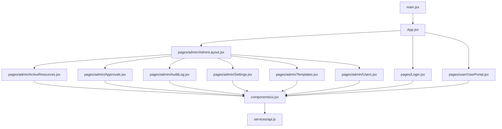
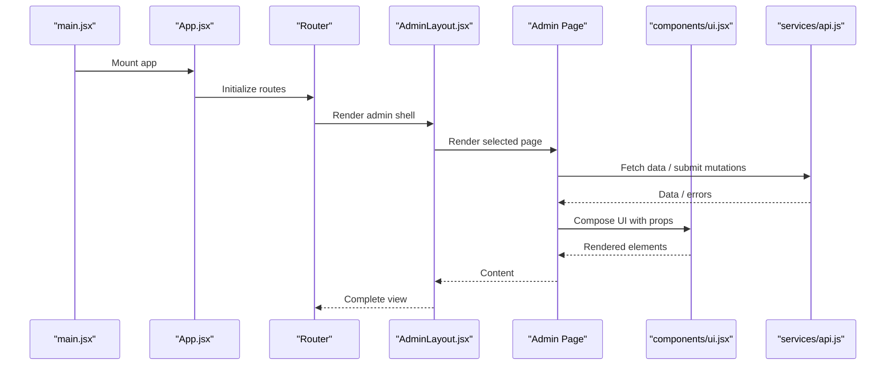
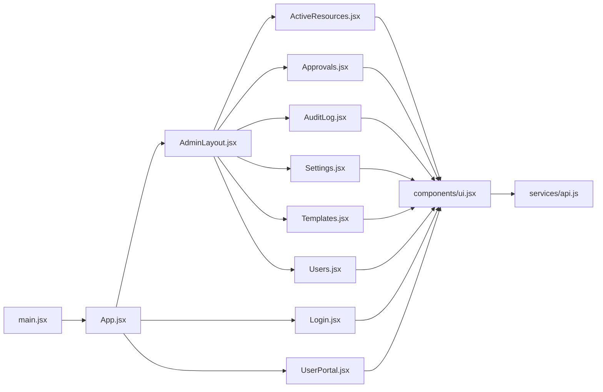

# Component Architecture & Structure

<cite>
**Referenced Files in This Document**
- [App.jsx](file://frontend/src/App.jsx)
- [main.jsx](file://frontend/src/main.jsx)
- [ui.jsx](file://frontend/src/components/ui.jsx)
- [AdminLayout.jsx](file://frontend/src/pages/admin/AdminLayout.jsx)
- [ActiveResources.jsx](file://frontend/src/pages/admin/ActiveResources.jsx)
- [Approvals.jsx](file://frontend/src/pages/admin/Approvals.jsx)
- [AuditLog.jsx](file://frontend/src/pages/admin/AuditLog.jsx)
- [Settings.jsx](file://frontend/src/pages/admin/Settings.jsx)
- [Templates.jsx](file://frontend/src/pages/admin/Templates.jsx)
- [Users.jsx](file://frontend/src/pages/admin/Users.jsx)
- [UserPortal.jsx](file://frontend/src/pages/user/UserPortal.jsx)
- [Login.jsx](file://frontend/src/pages/Login.jsx)
- [api.js](file://frontend/src/services/api.js)
</cite>

## Table of Contents
1. [Introduction](#introduction)
2. [Project Structure](#project-structure)
3. [Core Components](#core-components)
4. [Architecture Overview](#architecture-overview)
5. [Detailed Component Analysis](#detailed-component-analysis)
6. [Dependency Analysis](#dependency-analysis)
7. [Performance Considerations](#performance-considerations)
8. [Troubleshooting Guide](#troubleshooting-guide)
9. [Conclusion](#conclusion)
10. [Appendices](#appendices)

## Introduction
This document explains the React component architecture and structural patterns used in the frontend application. It focuses on:
- Separation between reusable UI components and page-specific components
- Component hierarchy and composition patterns
- Prop drilling versus context usage
- Layout components and their role in organizing page structures
- Lifecycle management strategies
- Guidelines for creating new components, naming conventions, and best practices for reusability and maintainability

The goal is to provide a clear mental model of how the application is organized and how to extend it safely and consistently.

## Project Structure
The frontend source code follows a feature-oriented layout with a clear separation between shared UI primitives and page-level components:
- Shared UI components live under components/ui.jsx
- Page components are grouped by domain (admin, user) under pages/*
- Application entry points are main.jsx and App.jsx
- API integration is centralized in services/api.js

**Diagram sources**
- [main.jsx](file://frontend/src/main.jsx)
- [App.jsx](file://frontend/src/App.jsx)
- [AdminLayout.jsx](file://frontend/src/pages/admin/AdminLayout.jsx)
- [Login.jsx](file://frontend/src/pages/Login.jsx)
- [UserPortal.jsx](file://frontend/src/pages/user/UserPortal.jsx)
- [ActiveResources.jsx](file://frontend/src/pages/admin/ActiveResources.jsx)
- [Approvals.jsx](file://frontend/src/pages/admin/Approvals.jsx)
- [AuditLog.jsx](file://frontend/src/pages/admin/AuditLog.jsx)
- [Settings.jsx](file://frontend/src/pages/admin/Settings.jsx)
- [Templates.jsx](file://frontend/src/pages/admin/Templates.jsx)
- [Users.jsx](file://frontend/src/pages/admin/Users.jsx)
- [ui.jsx](file://frontend/src/components/ui.jsx)
- [api.js](file://frontend/src/services/api.js)

**Section sources**
- [main.jsx](file://frontend/src/main.jsx)
- [App.jsx](file://frontend/src/App.jsx)
- [ui.jsx](file://frontend/src/components/ui.jsx)
- [AdminLayout.jsx](file://frontend/src/pages/admin/AdminLayout.jsx)
- [Login.jsx](file://frontend/src/pages/Login.jsx)
- [UserPortal.jsx](file://frontend/src/pages/user/UserPortal.jsx)
- [ActiveResources.jsx](file://frontend/src/pages/admin/ActiveResources.jsx)
- [Approvals.jsx](file://frontend/src/pages/admin/Approvals.jsx)
- [AuditLog.jsx](file://frontend/src/pages/admin/AuditLog.jsx)
- [Settings.jsx](file://frontend/src/pages/admin/Settings.jsx)
- [Templates.jsx](file://frontend/src/pages/admin/Templates.jsx)
- [Users.jsx](file://frontend/src/pages/admin/Users.jsx)
- [api.js](file://frontend/src/services/api.js)

## Core Components
- Reusable UI layer (components/ui.jsx): Provides small, focused building blocks such as buttons, inputs, cards, modals, and data display widgets. These components should be stateless or minimally stateful, accept props for behavior and appearance, and avoid direct knowledge of business logic or routes.
- Page components (pages/*): Implement screen-level concerns, orchestrate data fetching via services/api.js, compose multiple UI components, and manage local page state. They may use layout wrappers like AdminLayout.jsx to share chrome (sidebar, header).
- Layout component (AdminLayout.jsx): Encapsulates shared admin shell (navigation, breadcrumbs, content area), providing consistent structure across admin pages.

Guidelines:
- Keep UI components pure and composable; prefer composition over inheritance.
- Use prop interfaces that describe intent rather than implementation details.
- Avoid deep prop drilling by introducing lightweight contexts when needed (for example, theme, locale, or auth state).
- Centralize side effects and data access in page components or custom hooks, not in UI components.

**Section sources**
- [ui.jsx](file://frontend/src/components/ui.jsx)
- [AdminLayout.jsx](file://frontend/src/pages/admin/AdminLayout.jsx)
- [ActiveResources.jsx](file://frontend/src/pages/admin/ActiveResources.jsx)
- [Approvals.jsx](file://frontend/src/pages/admin/Approvals.jsx)
- [AuditLog.jsx](file://frontend/src/pages/admin/AuditLog.jsx)
- [Settings.jsx](file://frontend/src/pages/admin/Settings.jsx)
- [Templates.jsx](file://frontend/src/pages/admin/Templates.jsx)
- [Users.jsx](file://frontend/src/pages/admin/Users.jsx)
- [Login.jsx](file://frontend/src/pages/Login.jsx)
- [UserPortal.jsx](file://frontend/src/pages/user/UserPortal.jsx)

## Architecture Overview
The application bootstraps from main.jsx, which mounts the root App component. App orchestrates routing and selects either an admin layout or other top-level shells. Admin pages render within AdminLayout.jsx, while login and user portal screens have their own layouts. All pages consume shared UI components and call backend APIs through services/api.js.

**Diagram sources**
- [main.jsx](file://frontend/src/main.jsx)
- [App.jsx](file://frontend/src/App.jsx)
- [AdminLayout.jsx](file://frontend/src/pages/admin/AdminLayout.jsx)
- [ActiveResources.jsx](file://frontend/src/pages/admin/ActiveResources.jsx)
- [Approvals.jsx](file://frontend/src/pages/admin/Approvals.jsx)
- [AuditLog.jsx](file://frontend/src/pages/admin/AuditLog.jsx)
- [Settings.jsx](file://frontend/src/pages/admin/Settings.jsx)
- [Templates.jsx](file://frontend/src/pages/admin/Templates.jsx)
- [Users.jsx](file://frontend/src/pages/admin/Users.jsx)
- [ui.jsx](file://frontend/src/components/ui.jsx)
- [api.js](file://frontend/src/services/api.js)

## Detailed Component Analysis

### Reusable UI Layer (components/ui.jsx)
Responsibilities:
- Provide atomic UI elements (buttons, inputs, cards, tables, badges, etc.)
- Enforce consistent styling and behavior across the app
- Remain agnostic of routes and business logic

Patterns:
- Stateless functional components where possible
- Explicit prop interfaces with sensible defaults
- Composition-friendly design (children, slots)
- No direct network calls; delegate to page components or hooks

Best practices:
- One responsibility per component
- Favor controlled components for form fields
- Expose minimal public API surface

**Section sources**
- [ui.jsx](file://frontend/src/components/ui.jsx)

### Layout Component (AdminLayout.jsx)
Responsibilities:
- Provide consistent admin shell (header, sidebar, navigation, content area)
- Manage global layout state (collapsed sidebar, active route highlighting)
- Compose child pages inside a stable container

Composition:
- Accepts children to render page content
- May wrap pages with common features (breadcrumbs, notifications)

Lifecycle considerations:
- Persist layout preferences using local storage if applicable
- Handle keyboard shortcuts or global actions at this level

**Section sources**
- [AdminLayout.jsx](file://frontend/src/pages/admin/AdminLayout.jsx)

### Admin Pages
Pages implement screen-level logic and compose UI components:
- ActiveResources.jsx
- Approvals.jsx
- AuditLog.jsx
- Settings.jsx
- Templates.jsx
- Users.jsx

Common responsibilities:
- Data fetching and mutation via services/api.js
- Local state for loading, error, and success states
- Validation and user feedback
- Composition of UI components into cohesive views

Prop drilling vs context:
- Prefer passing only necessary props to immediate children
- Introduce a lightweight context when multiple levels need shared values (e.g., current tenant, theme, or auth info)

**Section sources**
- [ActiveResources.jsx](file://frontend/src/pages/admin/ActiveResources.jsx)
- [Approvals.jsx](file://frontend/src/pages/admin/Approvals.jsx)
- [AuditLog.jsx](file://frontend/src/pages/admin/AuditLog.jsx)
- [Settings.jsx](file://frontend/src/pages/admin/Settings.jsx)
- [Templates.jsx](file://frontend/src/pages/admin/Templates.jsx)
- [Users.jsx](file://frontend/src/pages/admin/Users.jsx)

### Login and User Portal
- Login.jsx: Handles authentication flow, redirects upon success, and shows validation errors.
- UserPortal.jsx: Renders user-facing screens with its own layout and composed UI components.

These pages also rely on services/api.js for authentication and data operations.

**Section sources**
- [Login.jsx](file://frontend/src/pages/Login.jsx)
- [UserPortal.jsx](file://frontend/src/pages/user/UserPortal.jsx)

### Services Integration (services/api.js)
Centralizes HTTP requests, error normalization, and base configuration. Pages call this module instead of making fetch/axios calls directly.

Recommendations:
- Return promises with typed responses
- Normalize errors into a consistent shape
- Provide helpers for common operations (list, get, create, update, delete)

**Section sources**
- [api.js](file://frontend/src/services/api.js)

### Application Entry Points
- main.jsx: Bootstraps the app and mounts the root component.
- App.jsx: Configures routing and top-level providers (if any), then renders layout/page components based on the current route.

**Section sources**
- [main.jsx](file://frontend/src/main.jsx)
- [App.jsx](file://frontend/src/App.jsx)

## Dependency Analysis
High-level dependencies among key files:

**Diagram sources**
- [main.jsx](file://frontend/src/main.jsx)
- [App.jsx](file://frontend/src/App.jsx)
- [AdminLayout.jsx](file://frontend/src/pages/admin/AdminLayout.jsx)
- [Login.jsx](file://frontend/src/pages/Login.jsx)
- [UserPortal.jsx](file://frontend/src/pages/user/UserPortal.jsx)
- [ActiveResources.jsx](file://frontend/src/pages/admin/ActiveResources.jsx)
- [Approvals.jsx](file://frontend/src/pages/admin/Approvals.jsx)
- [AuditLog.jsx](file://frontend/src/pages/admin/AuditLog.jsx)
- [Settings.jsx](file://frontend/src/pages/admin/Settings.jsx)
- [Templates.jsx](file://frontend/src/pages/admin/Templates.jsx)
- [Users.jsx](file://frontend/src/pages/admin/Users.jsx)
- [ui.jsx](file://frontend/src/components/ui.jsx)
- [api.js](file://frontend/src/services/api.js)

**Section sources**
- [main.jsx](file://frontend/src/main.jsx)
- [App.jsx](file://frontend/src/App.jsx)
- [AdminLayout.jsx](file://frontend/src/pages/admin/AdminLayout.jsx)
- [Login.jsx](file://frontend/src/pages/Login.jsx)
- [UserPortal.jsx](file://frontend/src/pages/user/UserPortal.jsx)
- [ActiveResources.jsx](file://frontend/src/pages/admin/ActiveResources.jsx)
- [Approvals.jsx](file://frontend/src/pages/admin/Approvals.jsx)
- [AuditLog.jsx](file://frontend/src/pages/admin/AuditLog.jsx)
- [Settings.jsx](file://frontend/src/pages/admin/Settings.jsx)
- [Templates.jsx](file://frontend/src/pages/admin/Templates.jsx)
- [Users.jsx](file://frontend/src/pages/admin/Users.jsx)
- [ui.jsx](file://frontend/src/components/ui.jsx)
- [api.js](file://frontend/src/services/api.js)

## Performance Considerations
- Memoization: Wrap expensive computations and heavy components with memoization utilities to prevent unnecessary re-renders.
- Code splitting: Load page components lazily to reduce initial bundle size.
- List rendering: Ensure stable keys for list items and avoid inline object/function creation in render paths.
- State colocation: Keep state close to where it is used; lift state only when necessary.
- Debounce/throttle: Apply to search inputs and frequent events to limit re-renders and API calls.
- Image/media optimization: Lazy-load images and use appropriate formats/sizes.

[No sources needed since this section provides general guidance]

## Troubleshooting Guide
Common issues and resolutions:
- Missing props or undefined values: Verify prop interfaces and default values in UI components; add runtime checks during development.
- Stale closures in async flows: Ensure callbacks capture latest state or use refs where appropriate.
- Network errors: Centralize error handling in services/api.js and present user-friendly messages in page components.
- Layout inconsistencies: Confirm that AdminLayout wraps all admin pages and that nested routes do not bypass the layout.
- Memory leaks: Clean up event listeners, timers, and subscriptions in effect cleanup functions.

**Section sources**
- [ui.jsx](file://frontend/src/components/ui.jsx)
- [AdminLayout.jsx](file://frontend/src/pages/admin/AdminLayout.jsx)
- [api.js](file://frontend/src/services/api.js)

## Conclusion
The frontend follows a clean separation between reusable UI components and page-specific logic, with a dedicated layout component for admin experiences. Composition and explicit prop interfaces keep components predictable and testable. For cross-cutting concerns, introduce lightweight contexts judiciously. Centralizing API interactions and following consistent naming and file organization improves maintainability and developer productivity.

[No sources needed since this section summarizes without analyzing specific files]

## Appendices

### Naming Conventions
- File names: PascalCase for components (e.g., AdminLayout.jsx), kebab-case for stylesheets if separate.
- Component names: PascalCase, descriptive nouns or verb-noun pairs for action-oriented components.
- Props: camelCase, with clear types and defaults.
- Directories: Feature-based grouping (pages/admin, pages/user), shared UI in components/ui.jsx.

### Creating New Components
- Start small: Create focused UI components in components/ui.jsx if they can be reused.
- Build pages by composing UI components; keep business logic in page components.
- Define a minimal prop interface; prefer composition over many optional props.
- Add tests for critical UI components and page flows.

### Best Practices for Reusability and Maintainability
- Single Responsibility Principle per component
- Controlled components for forms
- Avoid prop drilling beyond two levels; use context sparingly
- Keep side effects in page components or custom hooks
- Centralize API calls in services/api.js
- Use consistent error and loading states across pages

[No sources needed since this section provides general guidance]