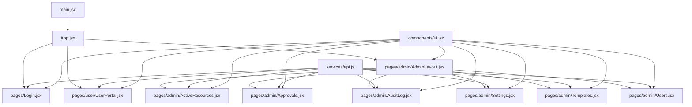
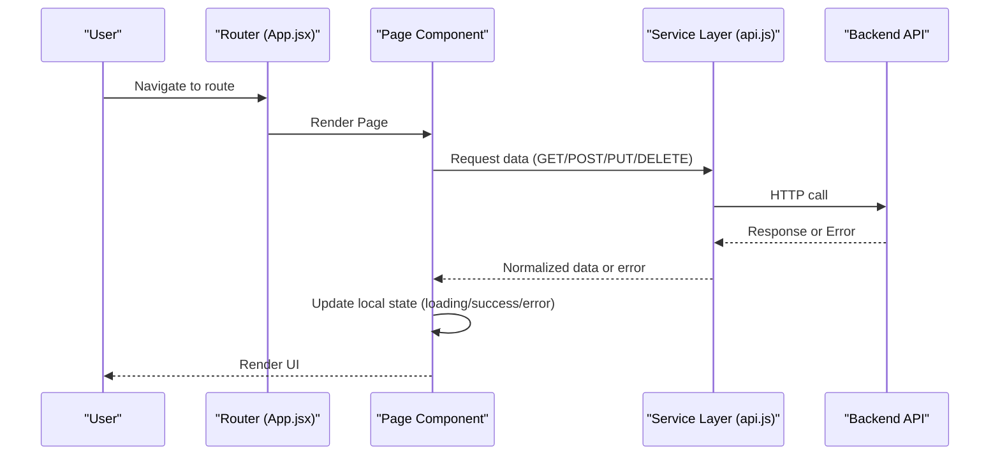
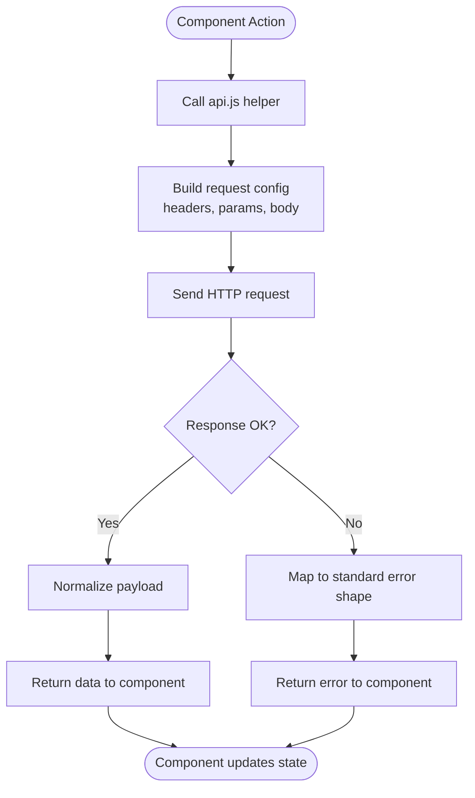
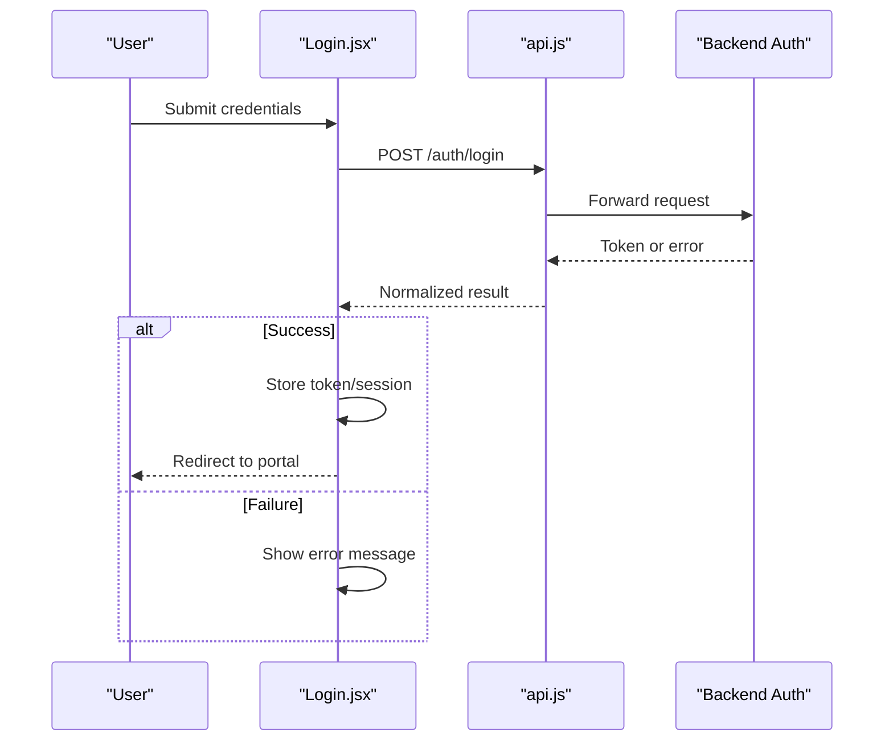
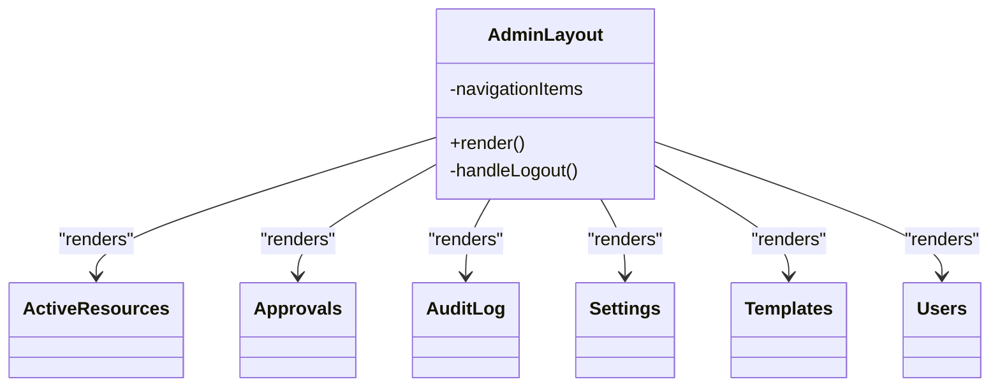
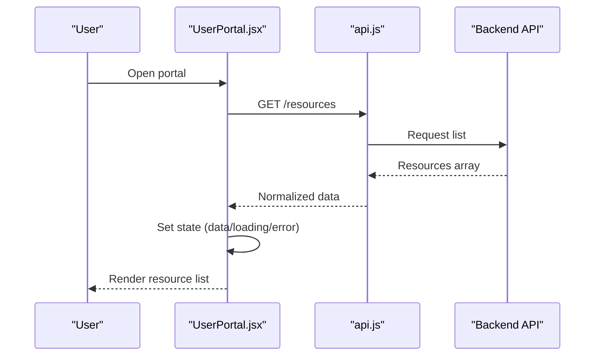
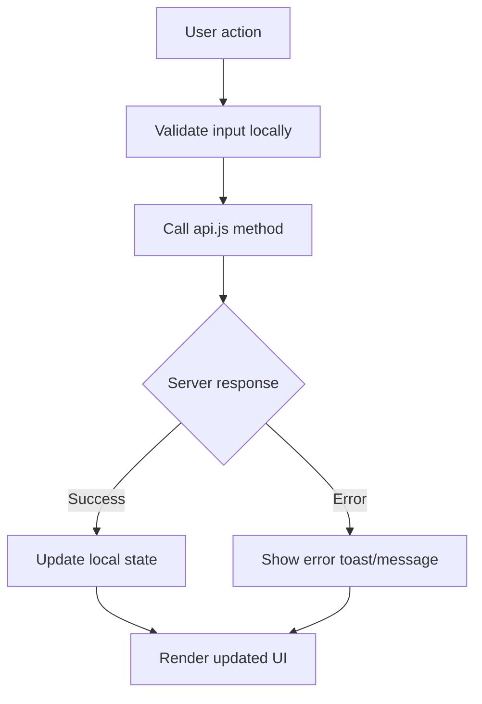
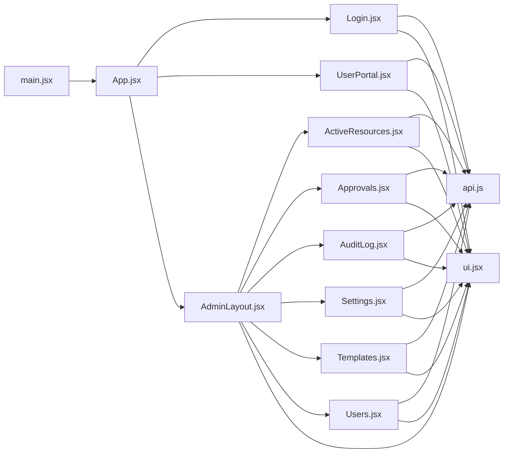

# Component Patterns & Best Practices

<cite>
**Referenced Files in This Document**
- [App.jsx](file://frontend/src/App.jsx)
- [main.jsx](file://frontend/src/main.jsx)
- [api.js](file://frontend/src/services/api.js)
- [ui.jsx](file://frontend/src/components/ui.jsx)
- [Login.jsx](file://frontend/src/pages/Login.jsx)
- [UserPortal.jsx](file://frontend/src/pages/user/UserPortal.jsx)
- [AdminLayout.jsx](file://frontend/src/pages/admin/AdminLayout.jsx)
- [ActiveResources.jsx](file://frontend/src/pages/admin/ActiveResources.jsx)
- [Approvals.jsx](file://frontend/src/pages/admin/Approvals.jsx)
- [AuditLog.jsx](file://frontend/src/pages/admin/AuditLog.jsx)
- [Settings.jsx](file://frontend/src/pages/admin/Settings.jsx)
- [Templates.jsx](file://frontend/src/pages/admin/Templates.jsx)
- [Users.jsx](file://frontend/src/pages/admin/Users.jsx)
</cite>

## Table of Contents
1. [Introduction](#introduction)
2. [Project Structure](#project-structure)
3. [Core Components](#core-components)
4. [Architecture Overview](#architecture-overview)
5. [Detailed Component Analysis](#detailed-component-analysis)
6. [Dependency Analysis](#dependency-analysis)
7. [Performance Considerations](#performance-considerations)
8. [Troubleshooting Guide](#troubleshooting-guide)
9. [Conclusion](#conclusion)
10. [Appendices](#appendices)

## Introduction
This document describes React component patterns and architectural best practices used across the frontend application. It focuses on:
- Prop drilling versus Context API usage
- Component composition strategies
- State management patterns
- Service layer integration with api.js for data operations
- Error handling approaches and loading states management
- Naming conventions and file organization patterns
- Testing strategies for components
- Performance optimization techniques
- Guidelines for creating maintainable and scalable component hierarchies

The goal is to provide a practical, code-backed guide that helps teams build consistent, readable, and performant React applications.

## Project Structure
The frontend follows a feature-based layout under src/:
- pages: Top-level page components grouped by role (user, admin). Each page typically owns its own state and composes UI components.
- services: Centralized service modules for external integrations (e.g., api.js).
- components: Shared UI primitives or reusable building blocks.
- App.jsx and main.jsx: Application bootstrap and routing entry points.

**Diagram sources**
- [main.jsx](file://frontend/src/main.jsx)
- [App.jsx](file://frontend/src/App.jsx)
- [Login.jsx](file://frontend/src/pages/Login.jsx)
- [UserPortal.jsx](file://frontend/src/pages/user/UserPortal.jsx)
- [AdminLayout.jsx](file://frontend/src/pages/admin/AdminLayout.jsx)
- [ActiveResources.jsx](file://frontend/src/pages/admin/ActiveResources.jsx)
- [Approvals.jsx](file://frontend/src/pages/admin/Approvals.jsx)
- [AuditLog.jsx](file://frontend/src/pages/admin/AuditLog.jsx)
- [Settings.jsx](file://frontend/src/pages/admin/Settings.jsx)
- [Templates.jsx](file://frontend/src/pages/admin/Templates.jsx)
- [Users.jsx](file://frontend/src/pages/admin/Users.jsx)
- [api.js](file://frontend/src/services/api.js)
- [ui.jsx](file://frontend/src/components/ui.jsx)

**Section sources**
- [main.jsx](file://frontend/src/main.jsx)
- [App.jsx](file://frontend/src/App.jsx)
- [api.js](file://frontend/src/services/api.js)
- [ui.jsx](file://frontend/src/components/ui.jsx)
- [Login.jsx](file://frontend/src/pages/Login.jsx)
- [UserPortal.jsx](file://frontend/src/pages/user/UserPortal.jsx)
- [AdminLayout.jsx](file://frontend/src/pages/admin/AdminLayout.jsx)
- [ActiveResources.jsx](file://frontend/src/pages/admin/ActiveResources.jsx)
- [Approvals.jsx](file://frontend/src/pages/admin/Approvals.jsx)
- [AuditLog.jsx](file://frontend/src/pages/admin/AuditLog.jsx)
- [Settings.jsx](file://frontend/src/pages/admin/Settings.jsx)
- [Templates.jsx](file://frontend/src/pages/admin/Templates.jsx)
- [Users.jsx](file://frontend/src/pages/admin/Users.jsx)

## Core Components
- Entry points
  - main.jsx bootstraps the React app and mounts it into the DOM.
  - App.jsx defines top-level routing and layout structure, composing page components based on routes.
- Pages
  - Login.jsx handles authentication flows and redirects upon success.
  - UserPortal.jsx provides user-facing features and integrates with api.js for data operations.
  - AdminLayout.jsx wraps admin pages with shared navigation and layout.
  - ActiveResources.jsx, Approvals.jsx, AuditLog.jsx, Settings.jsx, Templates.jsx, Users.jsx implement domain-specific views and actions.
- Services
  - api.js centralizes HTTP requests, error normalization, and response shaping for all pages.
- UI Primitives
  - ui.jsx contains reusable UI building blocks consumed by pages and layouts.

Best practices observed:
- Keep page components focused on orchestration: fetch data via api.js, manage local state, and compose UI primitives from ui.jsx.
- Avoid deep prop drilling; prefer composition and context where cross-cutting concerns (auth, theme, notifications) are needed.
- Centralize side effects and network calls in the service layer to keep components pure and testable.

**Section sources**
- [main.jsx](file://frontend/src/main.jsx)
- [App.jsx](file://frontend/src/App.jsx)
- [Login.jsx](file://frontend/src/pages/Login.jsx)
- [UserPortal.jsx](file://frontend/src/pages/user/UserPortal.jsx)
- [AdminLayout.jsx](file://frontend/src/pages/admin/AdminLayout.jsx)
- [ActiveResources.jsx](file://frontend/src/pages/admin/ActiveResources.jsx)
- [Approvals.jsx](file://frontend/src/pages/admin/Approvals.jsx)
- [AuditLog.jsx](file://frontend/src/pages/admin/AuditLog.jsx)
- [Settings.jsx](file://frontend/src/pages/admin/Settings.jsx)
- [Templates.jsx](file://frontend/src/pages/admin/Templates.jsx)
- [Users.jsx](file://frontend/src/pages/admin/Users.jsx)
- [api.js](file://frontend/src/services/api.js)
- [ui.jsx](file://frontend/src/components/ui.jsx)

## Architecture Overview
High-level architecture:
- Routing and layout are handled at the App level, delegating to page components.
- Pages coordinate business logic and state, calling api.js for data operations.
- Shared UI components from ui.jsx are composed within pages and layouts.
- Authentication and authorization checks occur before rendering protected routes.

**Diagram sources**
- [App.jsx](file://frontend/src/App.jsx)
- [api.js](file://frontend/src/services/api.js)
- [Login.jsx](file://frontend/src/pages/Login.jsx)
- [UserPortal.jsx](file://frontend/src/pages/user/UserPortal.jsx)
- [AdminLayout.jsx](file://frontend/src/pages/admin/AdminLayout.jsx)
- [ActiveResources.jsx](file://frontend/src/pages/admin/ActiveResources.jsx)
- [Approvals.jsx](file://frontend/src/pages/admin/Approvals.jsx)
- [AuditLog.jsx](file://frontend/src/pages/admin/AuditLog.jsx)
- [Settings.jsx](file://frontend/src/pages/admin/Settings.jsx)
- [Templates.jsx](file://frontend/src/pages/admin/Templates.jsx)
- [Users.jsx](file://frontend/src/pages/admin/Users.jsx)

## Detailed Component Analysis

### Service Layer Integration with api.js
Responsibilities:
- Encapsulate HTTP requests and URL construction.
- Normalize responses and errors consistently.
- Provide typed helpers for common operations (list, get, create, update, delete).
- Centralize headers, base URLs, and token management.

Recommended patterns:
- Use async functions returning normalized payloads.
- Separate request configuration from business logic.
- Implement retry/backoff for transient failures if needed.
- Expose clear error shapes for UI consumption.

**Diagram sources**
- [api.js](file://frontend/src/services/api.js)

**Section sources**
- [api.js](file://frontend/src/services/api.js)

### Authentication Flow (Login)
Flow overview:
- User submits credentials.
- Login page calls api.js to authenticate.
- On success, store session/token and redirect to appropriate dashboard.
- On failure, display validation or server errors.

**Diagram sources**
- [Login.jsx](file://frontend/src/pages/Login.jsx)
- [api.js](file://frontend/src/services/api.js)

**Section sources**
- [Login.jsx](file://frontend/src/pages/Login.jsx)
- [api.js](file://frontend/src/services/api.js)

### Admin Layout Composition
AdminLayout acts as a container for admin pages, providing:
- Navigation and sidebar
- Route guards for protected areas
- Shared header/footer and breadcrumbs

Composition strategy:
- Pass minimal props down; use children prop for page content.
- Extract global settings or auth state via Context if needed.
- Keep AdminLayout free of domain logic.

**Diagram sources**
- [AdminLayout.jsx](file://frontend/src/pages/admin/AdminLayout.jsx)
- [ActiveResources.jsx](file://frontend/src/pages/admin/ActiveResources.jsx)
- [Approvals.jsx](file://frontend/src/pages/admin/Approvals.jsx)
- [AuditLog.jsx](file://frontend/src/pages/admin/AuditLog.jsx)
- [Settings.jsx](file://frontend/src/pages/admin/Settings.jsx)
- [Templates.jsx](file://frontend/src/pages/admin/Templates.jsx)
- [Users.jsx](file://frontend/src/pages/admin/Users.jsx)

**Section sources**
- [AdminLayout.jsx](file://frontend/src/pages/admin/AdminLayout.jsx)
- [ActiveResources.jsx](file://frontend/src/pages/admin/ActiveResources.jsx)
- [Approvals.jsx](file://frontend/src/pages/admin/Approvals.jsx)
- [AuditLog.jsx](file://frontend/src/pages/admin/AuditLog.jsx)
- [Settings.jsx](file://frontend/src/pages/admin/Settings.jsx)
- [Templates.jsx](file://frontend/src/pages/admin/Templates.jsx)
- [Users.jsx](file://frontend/src/pages/admin/Users.jsx)

### User Portal Orchestration
UserPortal coordinates user-centric features:
- Fetches resources and displays them using ui.jsx primitives.
- Manages local state for lists, forms, and feedback.
- Delegates all network calls to api.js.

**Diagram sources**
- [UserPortal.jsx](file://frontend/src/pages/user/UserPortal.jsx)
- [api.js](file://frontend/src/services/api.js)

**Section sources**
- [UserPortal.jsx](file://frontend/src/pages/user/UserPortal.jsx)
- [api.js](file://frontend/src/services/api.js)

### Data Operations Flow (CRUD Example)
A typical CRUD flow:
- Read: List/get endpoints return normalized arrays/objects.
- Create: Submit form data via POST; handle success and errors.
- Update: PATCH/PUT with id and partial/full payload.
- Delete: DELETE with id confirmation.

[No sources needed since this diagram shows conceptual workflow, not actual code structure]

## Dependency Analysis
Key dependencies:
- main.jsx initializes the app and mounts App.jsx.
- App.jsx orchestrates routing and composes page components.
- Pages depend on api.js for data operations and on ui.jsx for UI primitives.
- AdminLayout composes multiple admin pages.

**Diagram sources**
- [main.jsx](file://frontend/src/main.jsx)
- [App.jsx](file://frontend/src/App.jsx)
- [Login.jsx](file://frontend/src/pages/Login.jsx)
- [UserPortal.jsx](file://frontend/src/pages/user/UserPortal.jsx)
- [AdminLayout.jsx](file://frontend/src/pages/admin/AdminLayout.jsx)
- [ActiveResources.jsx](file://frontend/src/pages/admin/ActiveResources.jsx)
- [Approvals.jsx](file://frontend/src/pages/admin/Approvals.jsx)
- [AuditLog.jsx](file://frontend/src/pages/admin/AuditLog.jsx)
- [Settings.jsx](file://frontend/src/pages/admin/Settings.jsx)
- [Templates.jsx](file://frontend/src/pages/admin/Templates.jsx)
- [Users.jsx](file://frontend/src/pages/admin/Users.jsx)
- [api.js](file://frontend/src/services/api.js)
- [ui.jsx](file://frontend/src/components/ui.jsx)

**Section sources**
- [main.jsx](file://frontend/src/main.jsx)
- [App.jsx](file://frontend/src/App.jsx)
- [api.js](file://frontend/src/services/api.js)
- [ui.jsx](file://frontend/src/components/ui.jsx)
- [Login.jsx](file://frontend/src/pages/Login.jsx)
- [UserPortal.jsx](file://frontend/src/pages/user/UserPortal.jsx)
- [AdminLayout.jsx](file://frontend/src/pages/admin/AdminLayout.jsx)
- [ActiveResources.jsx](file://frontend/src/pages/admin/ActiveResources.jsx)
- [Approvals.jsx](file://frontend/src/pages/admin/Approvals.jsx)
- [AuditLog.jsx](file://frontend/src/pages/admin/AuditLog.jsx)
- [Settings.jsx](file://frontend/src/pages/admin/Settings.jsx)
- [Templates.jsx](file://frontend/src/pages/admin/Templates.jsx)
- [Users.jsx](file://frontend/src/pages/admin/Users.jsx)

## Performance Considerations
- Memoization
  - Use memoization for expensive computations and stable references to avoid unnecessary re-renders.
  - Apply memoization selectively to heavy sub-trees or large lists.
- Rendering Optimization
  - Split large pages into smaller components to limit render scope.
  - Use virtualization for long lists to improve scroll performance.
- Network Efficiency
  - Cache responses when appropriate (in-memory cache or lightweight persistence).
  - Debounce search inputs and throttle frequent actions.
- Bundle Size
  - Lazy-load routes and heavy components to reduce initial bundle size.
  - Prefer tree-shakeable libraries and avoid unused imports.
- State Updates
  - Batch related state updates to minimize re-renders.
  - Derive values from existing state rather than duplicating data.

[No sources needed since this section provides general guidance]

## Troubleshooting Guide
Common issues and resolutions:
- Network Errors
  - Ensure api.js normalizes errors and surfaces actionable messages.
  - Add retries for transient failures and backoff strategies.
- Loading States
  - Always show explicit loading indicators during async operations.
  - Differentiate between initial load and background refresh states.
- Authentication Failures
  - Clear stale tokens on 401 responses and redirect to login.
  - Persist tokens securely and validate expiration client-side.
- UI Consistency
  - Centralize error toasts and alerts to avoid scattered handling.
  - Use consistent empty-state and skeleton loaders.

**Section sources**
- [api.js](file://frontend/src/services/api.js)
- [Login.jsx](file://frontend/src/pages/Login.jsx)
- [UserPortal.jsx](file://frontend/src/pages/user/UserPortal.jsx)
- [AdminLayout.jsx](file://frontend/src/pages/admin/AdminLayout.jsx)
- [ActiveResources.jsx](file://frontend/src/pages/admin/ActiveResources.jsx)
- [Approvals.jsx](file://frontend/src/pages/admin/Approvals.jsx)
- [AuditLog.jsx](file://frontend/src/pages/admin/AuditLog.jsx)
- [Settings.jsx](file://frontend/src/pages/admin/Settings.jsx)
- [Templates.jsx](file://frontend/src/pages/admin/Templates.jsx)
- [Users.jsx](file://frontend/src/pages/admin/Users.jsx)

## Conclusion
By centralizing data operations in api.js, composing pages around small, focused components, and adopting consistent error and loading patterns, the application achieves clarity, scalability, and maintainability. The guidelines above help teams extend the system confidently while preserving performance and readability.

[No sources needed since this section summarizes without analyzing specific files]

## Appendices

### Naming Conventions
- Files
  - PascalCase for components: Login.jsx, AdminLayout.jsx
  - kebab-case for utilities and styles (if applicable)
- Variables and Functions
  - camelCase for variables, functions, and methods
  - UPPER_SNAKE_CASE for constants
- Props
  - camelCase prop names; prefer descriptive, single-purpose props
- Components
  - One component per file; co-locate tests and styles near the component

### File Organization Patterns
- Feature-based grouping under pages/ by role or domain
- Shared UI primitives under components/
- Centralized services under services/
- Keep App.jsx focused on routing and layout composition

### Testing Strategies
- Unit Tests
  - Test pure components and utility functions with isolated inputs and outputs.
- Component Tests
  - Render components with mocked api.js responses to verify behavior.
  - Assert loading, success, and error states.
- Integration Tests
  - Validate critical user flows (login, create, update, delete) with mocked network layers.
- Accessibility and Visual Regression
  - Include basic a11y checks and snapshot tests for key UI surfaces.

### Prop Drilling vs Context API
- Prop Drilling
  - Acceptable for shallow hierarchies and simple data passing.
- Context API
  - Use for cross-cutting concerns like auth, theme, locale, and global notifications.
- Composition Strategy
  - Prefer composition over deep prop chains; pass callbacks and data explicitly where possible.

### State Management Patterns
- Local State
  - useState/useReducer for component-scoped state.
- Global State
  - Context for low-frequency updates; consider lightweight stores for high-frequency state.
- Server State
  - Cache and deduplicate requests in api.js; expose normalized shapes to components.

### Error Handling Approaches
- Centralized error mapping in api.js
- Consistent user-facing messages and toasts
- Graceful fallbacks and retry mechanisms

### Loading States Management
- Explicit loading flags per operation
- Skeleton loaders for predictable UX
- Optimistic updates with rollback on failure

### Performance Optimization Techniques
- Memoization and selective re-renders
- Virtualization for large datasets
- Code splitting and lazy loading
- Efficient event handling (debounce/throttle)

[No sources needed since this section provides general guidance]