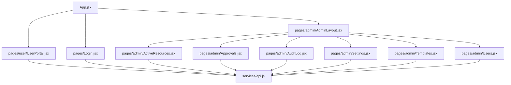
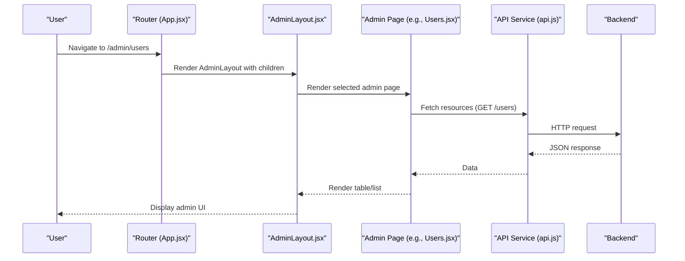
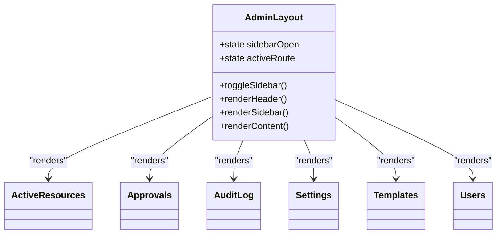
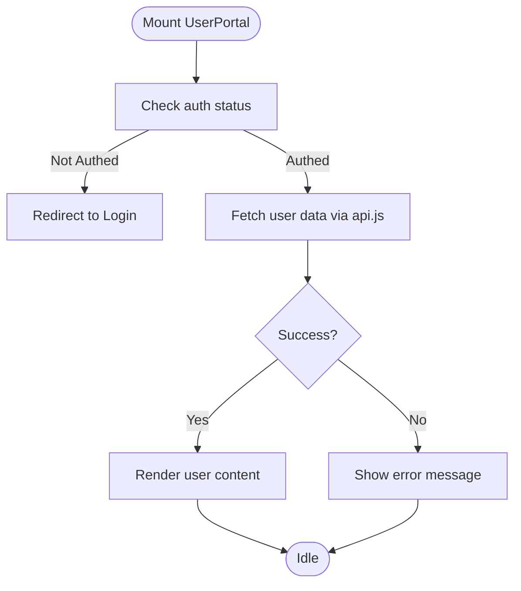
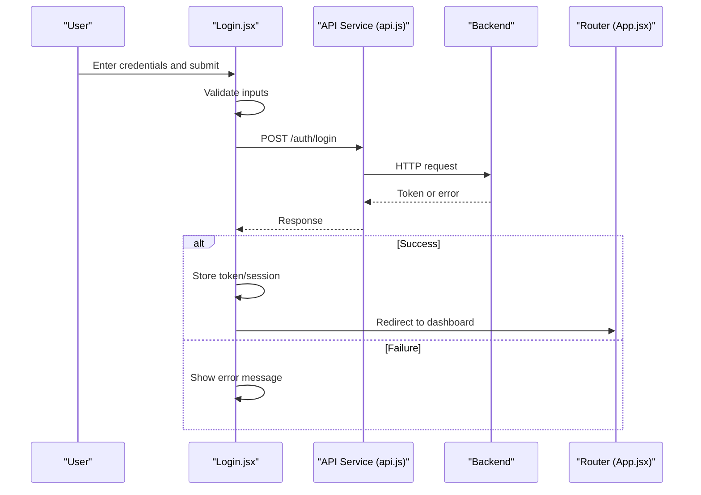
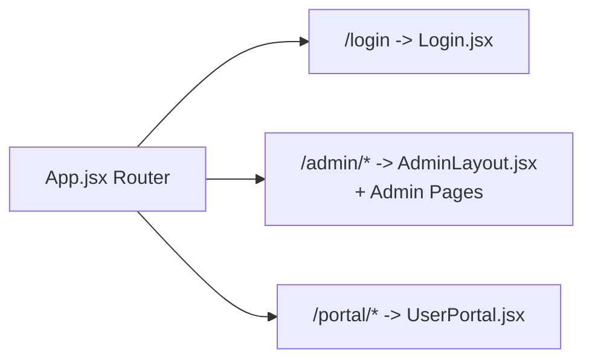
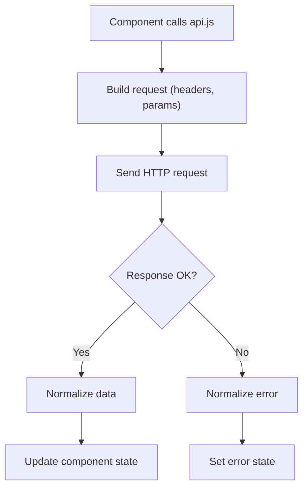
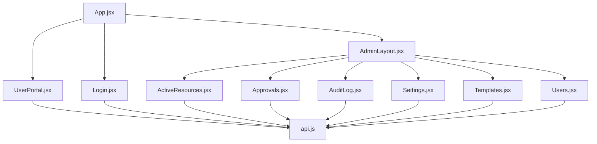

# Page Components & Layouts

<cite>
**Referenced Files in This Document**
- [App.jsx](file://frontend/src/App.jsx)
- [main.jsx](file://frontend/src/main.jsx)
- [AdminLayout.jsx](file://frontend/src/pages/admin/AdminLayout.jsx)
- [UserPortal.jsx](file://frontend/src/pages/user/UserPortal.jsx)
- [Login.jsx](file://frontend/src/pages/Login.jsx)
- [ActiveResources.jsx](file://frontend/src/pages/admin/ActiveResources.jsx)
- [Approvals.jsx](file://frontend/src/pages/admin/Approvals.jsx)
- [AuditLog.jsx](file://frontend/src/pages/admin/AuditLog.jsx)
- [Settings.jsx](file://frontend/src/pages/admin/Settings.jsx)
- [Templates.jsx](file://frontend/src/pages/admin/Templates.jsx)
- [Users.jsx](file://frontend/src/pages/admin/Users.jsx)
- [api.js](file://frontend/src/services/api.js)
</cite>

## Table of Contents
1. [Introduction](#introduction)
2. [Project Structure](#project-structure)
3. [Core Components](#core-components)
4. [Architecture Overview](#architecture-overview)
5. [Detailed Component Analysis](#detailed-component-analysis)
6. [Dependency Analysis](#dependency-analysis)
7. [Performance Considerations](#performance-considerations)
8. [Troubleshooting Guide](#troubleshooting-guide)
9. [Conclusion](#conclusion)
10. [Appendices](#appendices)

## Introduction
This document explains the page-level components and layout structures that power the application’s user interface. It focuses on:
- AdminLayout.jsx: the administrative framework including sidebar navigation, header, and content area management.
- UserPortal.jsx: the user-facing portal structure.
- Login.jsx: the authentication flow and integration with routing and state.
It also covers routing integration, page-level state management, data fetching patterns, error handling strategies, and guidelines for creating new pages while maintaining consistent layouts across roles.

## Project Structure
The frontend is organized by feature and role:
- pages/admin: admin-only pages and shared admin layout
- pages/user: user-facing pages
- services: API client utilities
- App.jsx: top-level routing and layout orchestration
- main.jsx: application bootstrap

**Diagram sources**
- [App.jsx](file://frontend/src/App.jsx)
- [AdminLayout.jsx](file://frontend/src/pages/admin/AdminLayout.jsx)
- [UserPortal.jsx](file://frontend/src/pages/user/UserPortal.jsx)
- [Login.jsx](file://frontend/src/pages/Login.jsx)
- [ActiveResources.jsx](file://frontend/src/pages/admin/ActiveResources.jsx)
- [Approvals.jsx](file://frontend/src/pages/admin/Approvals.jsx)
- [AuditLog.jsx](file://frontend/src/pages/admin/AuditLog.jsx)
- [Settings.jsx](file://frontend/src/pages/admin/Settings.jsx)
- [Templates.jsx](file://frontend/src/pages/admin/Templates.jsx)
- [Users.jsx](file://frontend/src/pages/admin/Users.jsx)
- [api.js](file://frontend/src/services/api.js)

**Section sources**
- [App.jsx](file://frontend/src/App.jsx)
- [main.jsx](file://frontend/src/main.jsx)

## Core Components
- AdminLayout.jsx
  - Provides a consistent shell for admin pages: fixed or sticky header, collapsible sidebar with navigation links, and a main content area where specific admin pages are rendered.
  - Manages local UI state such as sidebar open/close and active route highlighting.
  - Enforces role-based visibility for menu items and guards access to protected routes at the layout level.
- UserPortal.jsx
  - Serves as the container for user-facing features.
  - Renders role-appropriate sections and delegates to child pages or widgets.
  - Integrates with the API service for data retrieval and mutation.
- Login.jsx
  - Handles credential submission, token storage, and redirection upon success.
  - Displays validation and network errors to users.
  - Integrates with routing to redirect authenticated users away from login.

**Section sources**
- [AdminLayout.jsx](file://frontend/src/pages/admin/AdminLayout.jsx)
- [UserPortal.jsx](file://frontend/src/pages/user/UserPortal.jsx)
- [Login.jsx](file://frontend/src/pages/Login.jsx)

## Architecture Overview
High-level flow of how pages and layouts interact with routing and the API:

**Diagram sources**
- [App.jsx](file://frontend/src/App.jsx)
- [AdminLayout.jsx](file://frontend/src/pages/admin/AdminLayout.jsx)
- [Users.jsx](file://frontend/src/pages/admin/Users.jsx)
- [api.js](file://frontend/src/services/api.js)

## Detailed Component Analysis

### AdminLayout.jsx
Responsibilities:
- Shell composition: header, sidebar, and content area.
- Navigation: renders links to admin pages and highlights the active route.
- State: manages sidebar toggle and active link state.
- Guarding: ensures only authorized users can access admin routes; redirects otherwise.

Key implementation patterns:
- Uses React state for UI toggles and active route tracking.
- Wraps child routes within a layout component to share chrome across admin pages.
- Centralizes navigation configuration for consistency.

**Diagram sources**
- [AdminLayout.jsx](file://frontend/src/pages/admin/AdminLayout.jsx)
- [ActiveResources.jsx](file://frontend/src/pages/admin/ActiveResources.jsx)
- [Approvals.jsx](file://frontend/src/pages/admin/Approvals.jsx)
- [AuditLog.jsx](file://frontend/src/pages/admin/AuditLog.jsx)
- [Settings.jsx](file://frontend/src/pages/admin/Settings.jsx)
- [Templates.jsx](file://frontend/src/pages/admin/Templates.jsx)
- [Users.jsx](file://frontend/src/pages/admin/Users.jsx)

**Section sources**
- [AdminLayout.jsx](file://frontend/src/pages/admin/AdminLayout.jsx)

### UserPortal.jsx
Responsibilities:
- Container for user-facing functionality.
- Delegates to sub-pages or widgets based on current route.
- Integrates with api.js for data operations.

State and data flow:
- Local state for loading, error, and data.
- Effects trigger data fetches when dependencies change.
- Error boundaries or inline try/catch blocks handle failures.

**Diagram sources**
- [UserPortal.jsx](file://frontend/src/pages/user/UserPortal.jsx)
- [api.js](file://frontend/src/services/api.js)

**Section sources**
- [UserPortal.jsx](file://frontend/src/pages/user/UserPortal.jsx)

### Login.jsx
Authentication flow:
- Validates inputs locally.
- Submits credentials to the backend via api.js.
- Stores tokens/session on success.
- Redirects to appropriate dashboard based on role.
- Displays validation and network errors.

**Diagram sources**
- [Login.jsx](file://frontend/src/pages/Login.jsx)
- [api.js](file://frontend/src/services/api.js)
- [App.jsx](file://frontend/src/App.jsx)

**Section sources**
- [Login.jsx](file://frontend/src/pages/Login.jsx)

### Routing Integration
Top-level routing orchestrates which layout and page to render:
- Public routes: Login.
- Protected admin routes: AdminLayout wrapping admin pages.
- User routes: UserPortal for non-admin users.

**Diagram sources**
- [App.jsx](file://frontend/src/App.jsx)
- [AdminLayout.jsx](file://frontend/src/pages/admin/AdminLayout.jsx)
- [UserPortal.jsx](file://frontend/src/pages/user/UserPortal.jsx)
- [Login.jsx](file://frontend/src/pages/Login.jsx)

**Section sources**
- [App.jsx](file://frontend/src/App.jsx)

### Page-Level State Management
Common patterns used across pages:
- Local state for UI interactions (open/close panels, form fields).
- Derived state for computed values.
- Effects to synchronize with external data sources.
- Memoization for expensive computations.

Guidelines:
- Keep state co-located near the component that uses it.
- Lift state only when multiple siblings need shared state.
- Avoid global state unless necessary; prefer prop drilling or context sparingly.

[No sources needed since this section provides general guidance]

### Data Fetching Patterns
Centralized API client:
- All HTTP requests go through api.js to ensure consistent headers, base URLs, and error normalization.
- Request/response interceptors can be added for logging and retries.

Typical flow:
- Component triggers fetch on mount or dependency change.
- Loading state prevents duplicate requests.
- Errors are normalized and surfaced to the UI.

**Diagram sources**
- [api.js](file://frontend/src/services/api.js)

**Section sources**
- [api.js](file://frontend/src/services/api.js)

### Error Handling Strategies
- Input validation before submission.
- Network error handling with user-friendly messages.
- Retry logic for transient failures (optional).
- Global error boundary for unexpected crashes.

Best practices:
- Normalize error payloads into a common shape.
- Provide actionable feedback to users.
- Log errors for debugging without exposing sensitive details.

[No sources needed since this section provides general guidance]

### Guidelines for Creating New Pages
To add a new page consistently:
1. Create the page file under the appropriate folder:
   - Admin pages: pages/admin/NewPage.jsx
   - User pages: pages/user/NewPage.jsx
2. Integrate routing in App.jsx:
   - Add a route mapping to the new page.
   - Wrap admin routes with AdminLayout.
3. Use AdminLayout for admin pages:
   - Ensure the page fits within the content area.
   - Follow existing spacing and typography conventions.
4. Manage state locally:
   - Use useState/useEffect for simple cases.
   - Lift state only when needed.
5. Fetch data via api.js:
   - Encapsulate endpoints in api.js.
   - Handle loading and error states.
6. Maintain accessibility:
   - Use semantic HTML and keyboard navigation.
   - Provide meaningful labels and ARIA attributes.
7. Test:
   - Unit test critical logic.
   - Smoke-test the full flow in the browser.

[No sources needed since this section provides general guidance]

## Dependency Analysis
Relationships between key files:

**Diagram sources**
- [App.jsx](file://frontend/src/App.jsx)
- [AdminLayout.jsx](file://frontend/src/pages/admin/AdminLayout.jsx)
- [UserPortal.jsx](file://frontend/src/pages/user/UserPortal.jsx)
- [Login.jsx](file://frontend/src/pages/Login.jsx)
- [ActiveResources.jsx](file://frontend/src/pages/admin/ActiveResources.jsx)
- [Approvals.jsx](file://frontend/src/pages/admin/Approvals.jsx)
- [AuditLog.jsx](file://frontend/src/pages/admin/AuditLog.jsx)
- [Settings.jsx](file://frontend/src/pages/admin/Settings.jsx)
- [Templates.jsx](file://frontend/src/pages/admin/Templates.jsx)
- [Users.jsx](file://frontend/src/pages/admin/Users.jsx)
- [api.js](file://frontend/src/services/api.js)

**Section sources**
- [App.jsx](file://frontend/src/App.jsx)
- [api.js](file://frontend/src/services/api.js)

## Performance Considerations
- Lazy load heavy admin pages using dynamic imports to reduce initial bundle size.
- Debounce search inputs and pagination handlers.
- Cache frequently accessed data using in-memory caches or browser storage where appropriate.
- Minimize re-renders by memoizing derived data and stable props.
- Use virtualization for large lists.

[No sources needed since this section provides general guidance]

## Troubleshooting Guide
Common issues and resolutions:
- 401 Unauthorized on API calls:
  - Verify token presence and expiration.
  - Refresh token if supported; otherwise redirect to login.
- Blank admin pages:
  - Confirm route path matches the one defined in App.jsx.
  - Ensure AdminLayout wraps the route correctly.
- Sidebar not updating active link:
  - Check active route matching logic and URL paths.
- Data not rendering:
  - Inspect network tab for failed requests.
  - Ensure api.js returns normalized data and errors are handled.

[No sources needed since this section provides general guidance]

## Conclusion
The page-level architecture centers around a clear separation of concerns:
- AdminLayout provides a consistent admin shell.
- UserPortal encapsulates user-facing flows.
- Login handles authentication and redirects.
Routing, state, and data fetching are kept cohesive and maintainable, enabling consistent experiences across roles and straightforward extension for new pages.

[No sources needed since this section summarizes without analyzing specific files]

## Appendices
- File locations for quick reference:
  - Admin layout and pages: pages/admin/*
  - User portal: pages/user/UserPortal.jsx
  - Authentication: pages/Login.jsx
  - API client: services/api.js
  - Top-level routing: App.jsx

[No sources needed since this section provides general guidance]