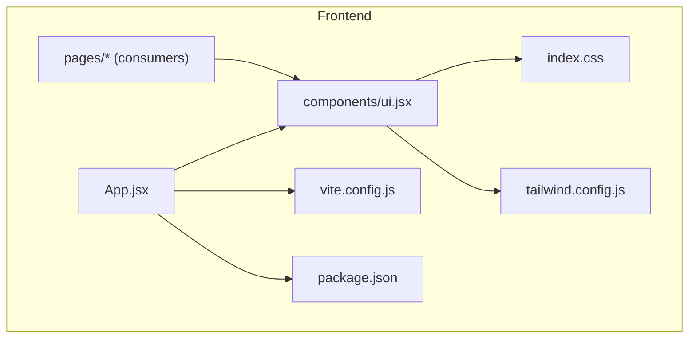
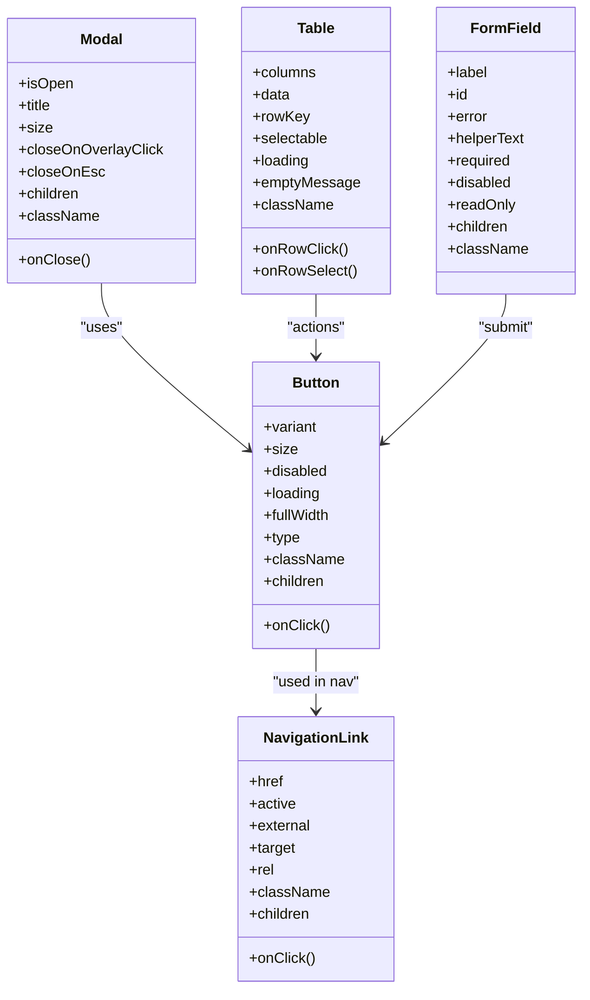
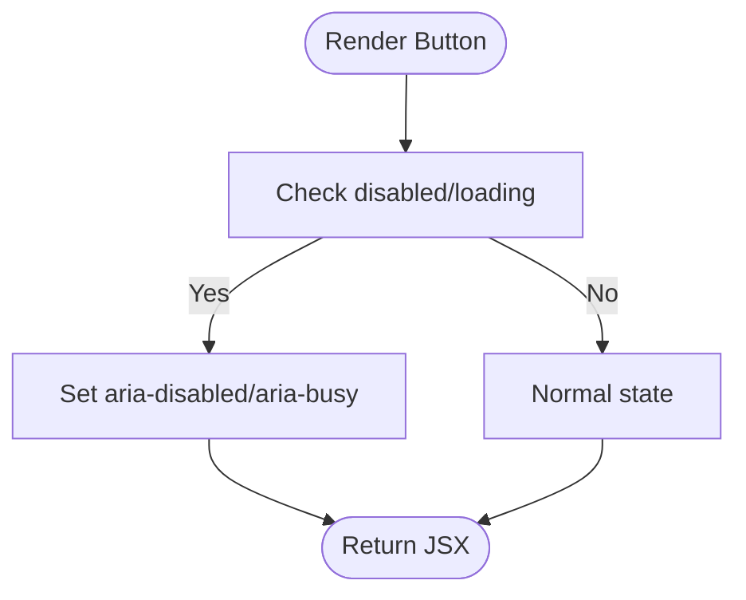
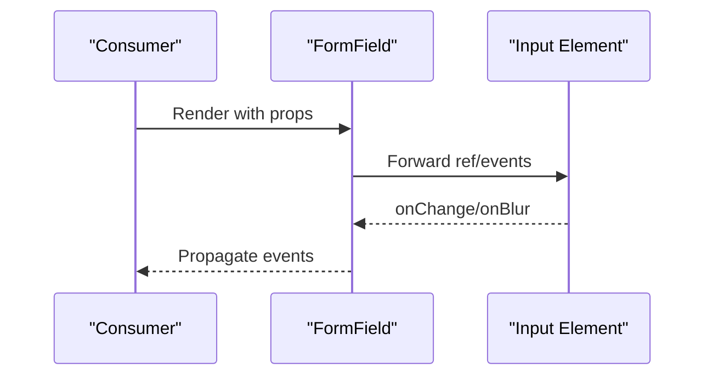
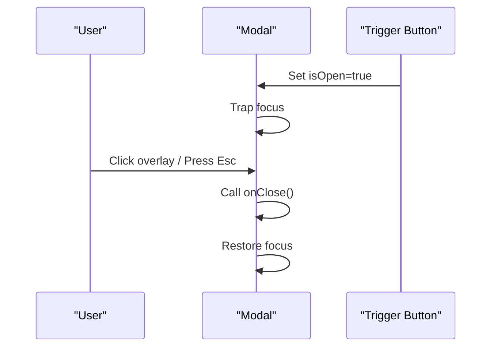
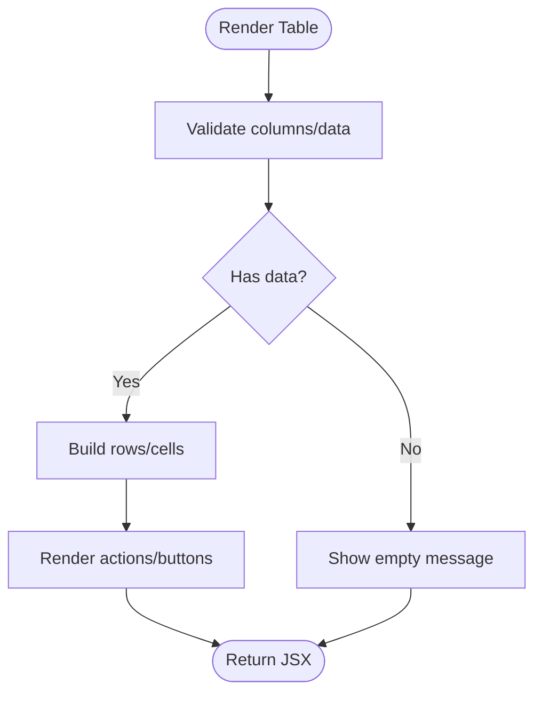
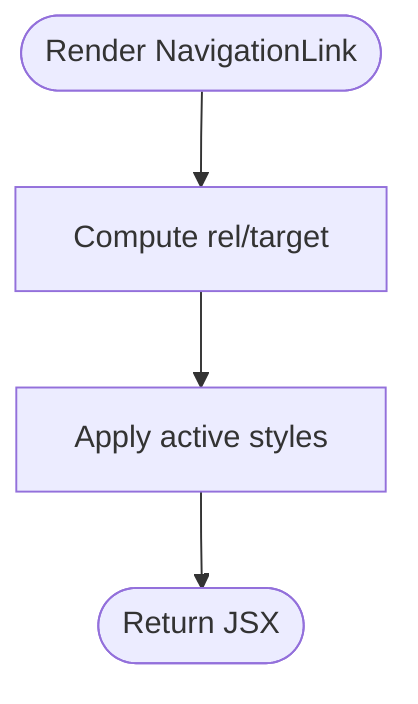
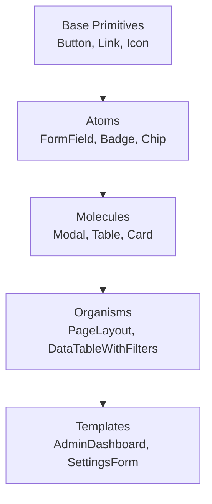
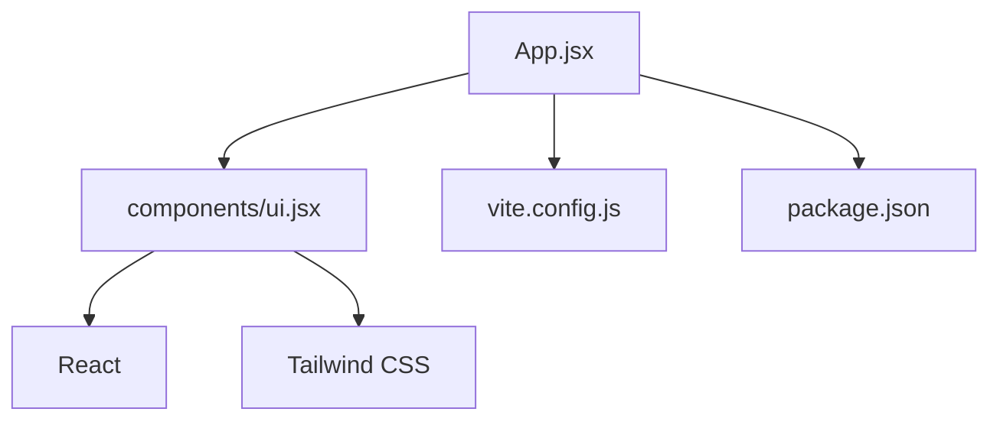

# UI Components Library

<cite>
**Referenced Files in This Document**
- [ui.jsx](file://frontend/src/components/ui.jsx)
- [App.jsx](file://frontend/src/App.jsx)
- [index.css](file://frontend/src/index.css)
- [tailwind.config.js](file://frontend/tailwind.config.js)
- [package.json](file://frontend/package.json)
- [vite.config.js](file://frontend/vite.config.js)
</cite>

## Table of Contents
1. [Introduction](#introduction)
2. [Project Structure](#project-structure)
3. [Core Components](#core-components)
4. [Architecture Overview](#architecture-overview)
5. [Detailed Component Analysis](#detailed-component-analysis)
6. [Dependency Analysis](#dependency-analysis)
7. [Performance Considerations](#performance-considerations)
8. [Troubleshooting Guide](#troubleshooting-guide)
9. [Conclusion](#conclusion)
10. [Appendices](#appendices)

## Introduction
This document describes the reusable UI components library implemented in the frontend application. It focuses on shared building blocks such as buttons, forms, modals, tables, and navigation elements. For each component, it specifies props/attributes, default values, event handlers, styling options, usage patterns, accessibility features, responsive considerations, and guidance for extending or creating custom variants while maintaining consistency with the design system.

The library is built using React and styled with Tailwind CSS. The configuration and build setup are provided by Vite and Tailwind.

## Project Structure
The UI components live under a dedicated folder and are consumed by pages throughout the application. The following diagram shows how the components integrate with the app shell and styling system.

**Diagram sources**
- [App.jsx](file://frontend/src/App.jsx)
- [ui.jsx](file://frontend/src/components/ui.jsx)
- [index.css](file://frontend/src/index.css)
- [tailwind.config.js](file://frontend/tailwind.config.js)
- [vite.config.js](file://frontend/vite.config.js)
- [package.json](file://frontend/package.json)

**Section sources**
- [ui.jsx](file://frontend/src/components/ui.jsx)
- [App.jsx](file://frontend/src/App.jsx)
- [index.css](file://frontend/src/index.css)
- [tailwind.config.js](file://frontend/tailwind.config.js)
- [vite.config.js](file://frontend/vite.config.js)
- [package.json](file://frontend/package.json)

## Core Components
The library provides the following core components:
- Button
- FormField
- Modal
- Table
- NavigationLink

Each component is designed to be composable, accessible, and responsive. Styling is primarily driven by Tailwind utility classes, with optional overrides via className.

### Button
A versatile button supporting multiple visual variants and states.

- Props
  - variant: primary | secondary | ghost | danger
  - size: sm | md | lg
  - disabled: boolean
  - loading: boolean
  - fullWidth: boolean
  - type: button | submit | reset
  - onClick: function
  - className: string
  - children: node
- Default values
  - variant: primary
  - size: md
  - disabled: false
  - loading: false
  - fullWidth: false
  - type: button
- Event handlers
  - onClick: invoked when the button is clicked; prevented if disabled or loading
- Styling options
  - Uses Tailwind classes for colors, spacing, and typography
  - className allows additional overrides
  - Responsive behavior controlled via Tailwind breakpoints
- Accessibility
  - role="button" when not using native <button>
  - aria-disabled when disabled
  - aria-busy when loading
  - keyboard support (Enter/Space)
- Usage example
  - See [Button usage examples](file://frontend/src/components/ui.jsx)

**Section sources**
- [ui.jsx](file://frontend/src/components/ui.jsx)

### FormField
A form control wrapper that standardizes labels, helpers, errors, and validation feedback.

- Props
  - label: string
  - id: string
  - error: string
  - helperText: string
  - required: boolean
  - disabled: boolean
  - readOnly: boolean
  - children: input/select/textarea element
  - className: string
- Default values
  - required: false
  - disabled: false
  - readOnly: false
- Event handlers
  - Forwarded events from child input (onChange, onBlur, onFocus)
- Styling options
  - Tailwind-based layout and typography
  - Error state uses distinct color and iconography
  - className for additional overrides
- Accessibility
  - htmlFor/id pairing between label and input
  - aria-describedby for helper/error text
  - aria-invalid when error present
- Usage example
  - See [FormField usage examples](file://frontend/src/components/ui.jsx)

**Section sources**
- [ui.jsx](file://frontend/src/components/ui.jsx)

### Modal
A focus-trapped overlay dialog for confirmations, wizards, or detailed views.

- Props
  - isOpen: boolean
  - onClose: function
  - title: string
  - size: sm | md | lg | xl
  - closeOnOverlayClick: boolean
  - closeOnEsc: boolean
  - children: node
  - className: string
- Default values
  - closeOnOverlayClick: true
  - closeOnEsc: true
- Event handlers
  - onClose: called on overlay click, Escape key, or explicit close action
- Styling options
  - Centered overlay with backdrop blur
  - Size variants adjust max-width
  - className for additional overrides
- Accessibility
  - Focus trap inside modal
  - aria-modal="true"
  - aria-labelledby/title association
  - Return focus to trigger on close
- Usage example
  - See [Modal usage examples](file://frontend/src/components/ui.jsx)

**Section sources**
- [ui.jsx](file://frontend/src/components/ui.jsx)

### Table
A data table with header, rows, and optional actions.

- Props
  - columns: array of column definitions
  - data: array of row objects
  - rowKey: string (unique field per row)
  - selectable: boolean
  - onRowClick: function
  - onRowSelect: function
  - loading: boolean
  - emptyMessage: string
  - className: string
- Column definition shape
  - key: string
  - header: string
  - render?: function(row)
  - width?: string
  - align?: left | center | right
- Default values
  - selectable: false
  - loading: false
  - emptyMessage: "No data available"
- Event handlers
  - onRowClick(row): invoked when a row is clicked
  - onRowSelect(rows): invoked when selection changes
- Styling options
  - Striped rows, hover states, sticky headers
  - Responsive horizontal scroll on small screens
  - className for additional overrides
- Accessibility
  - Proper table semantics (thead, tbody, th, td)
  - aria-sort for sortable columns (if implemented)
  - Keyboard navigation for interactive cells
- Usage example
  - See [Table usage examples](file://frontend/src/components/ui.jsx)

**Section sources**
- [ui.jsx](file://frontend/src/components/ui.jsx)

### NavigationLink
A link component used in navigation bars and menus.

- Props
  - href: string
  - active: boolean
  - external: boolean
  - target: string
  - rel: string
  - onClick: function
  - className: string
  - children: node
- Default values
  - active: false
  - external: false
  - target: "_self"
  - rel: ""
- Event handlers
  - onClick: invoked before navigation; can prevent default
- Styling options
  - Active state highlighting
  - Hover and focus styles
  - className for additional overrides
- Accessibility
  - Semantic <a> element
  - aria-current="page" when active
  - rel="noopener noreferrer" when external
- Usage example
  - See [NavigationLink usage examples](file://frontend/src/components/ui.jsx)

**Section sources**
- [ui.jsx](file://frontend/src/components/ui.jsx)

## Architecture Overview
The components are organized as pure, composable React primitives. They rely on Tailwind CSS for styling and do not introduce heavy runtime dependencies. Consumers import components directly and compose them into page-level layouts.

**Diagram sources**
- [ui.jsx](file://frontend/src/components/ui.jsx)

## Detailed Component Analysis

### Button
- Implementation pattern
  - Renders a native <button> by default; supports type switching
  - Applies variant-specific color palettes and size tokens
  - Disables pointer events and updates aria attributes when disabled/loading
- Data structures
  - Variant map defines color and style tokens
  - Size map defines padding and font sizes
- Dependency chains
  - Depends on Tailwind utilities; no other internal components
- Optimization opportunities
  - Memoize variant/style maps
  - Avoid re-renders by stabilizing onClick
- Error handling
  - Prevents default behavior when disabled/loading
- Performance implications
  - Lightweight; minimal DOM and no side effects

**Diagram sources**
- [ui.jsx](file://frontend/src/components/ui.jsx)

**Section sources**
- [ui.jsx](file://frontend/src/components/ui.jsx)

### FormField
- Implementation pattern
  - Wraps any input-like child and injects label, helper, and error regions
  - Forwards ref and events to the underlying input
- Data structures
  - Validation state managed by consumer; component displays error strings
- Dependency chains
  - No internal dependencies; relies on semantic HTML and Tailwind
- Optimization opportunities
  - Use React.forwardRef to expose input methods
  - Debounce onChange at consumer level for expensive validations
- Error handling
  - Displays error messages and sets aria-invalid accordingly
- Performance implications
  - Minimal overhead; purely presentational wrapper

**Diagram sources**
- [ui.jsx](file://frontend/src/components/ui.jsx)

**Section sources**
- [ui.jsx](file://frontend/src/components/ui.jsx)

### Modal
- Implementation pattern
  - Renders an overlay and a content panel
  - Traps focus within the modal and restores focus on close
- Data structures
  - State for open/close and focus management
- Dependency chains
  - Uses Button for close action; may use Table/Button internally
- Optimization opportunities
  - Portal rendering to avoid z-index stacking issues
  - Lazy mount content until first open
- Error handling
  - Gracefully handles missing onClose
- Performance implications
  - Overlay remains lightweight; consider memoization for large content

**Diagram sources**
- [ui.jsx](file://frontend/src/components/ui.jsx)

**Section sources**
- [ui.jsx](file://frontend/src/components/ui.jsx)

### Table
- Implementation pattern
  - Maps columns and rows to semantic table markup
  - Supports selection and row actions
- Data structures
  - Columns array and data array define structure
- Dependency chains
  - May render Button for row actions
- Optimization opportunities
  - Virtualize long lists for performance
  - Stabilize column definitions and row keys
- Error handling
  - Empty state message when data is absent
- Performance implications
  - Rendering cost scales with number of rows; virtualization recommended for large datasets

**Diagram sources**
- [ui.jsx](file://frontend/src/components/ui.jsx)

**Section sources**
- [ui.jsx](file://frontend/src/components/ui.jsx)

### NavigationLink
- Implementation pattern
  - Renders a semantic anchor with active state and external link safety
- Data structures
  - Simple props-driven state
- Dependency chains
  - No internal dependencies
- Optimization opportunities
  - Memoize computed rel/target based on external prop
- Error handling
  - Safe defaults for missing href
- Performance implications
  - Negligible; presentational only

**Diagram sources**
- [ui.jsx](file://frontend/src/components/ui.jsx)

**Section sources**
- [ui.jsx](file://frontend/src/components/ui.jsx)

### Conceptual Overview
The components follow consistent composition patterns:
- Prefer composition over configuration: pass children and slot content where appropriate
- Keep styling declarative via Tailwind; avoid inline styles
- Expose minimal, stable APIs focused on behavior and appearance
- Maintain accessibility by default and provide hooks for advanced cases

[No sources needed since this diagram shows conceptual workflow, not actual code structure]

## Dependency Analysis
The UI components depend on:
- React for rendering and composition
- Tailwind CSS for styling
- Vite for development/build tooling
- Package manager for dependency resolution

**Diagram sources**
- [ui.jsx](file://frontend/src/components/ui.jsx)
- [App.jsx](file://frontend/src/App.jsx)
- [vite.config.js](file://frontend/vite.config.js)
- [package.json](file://frontend/package.json)

**Section sources**
- [ui.jsx](file://frontend/src/components/ui.jsx)
- [App.jsx](file://frontend/src/App.jsx)
- [vite.config.js](file://frontend/vite.config.js)
- [package.json](file://frontend/package.json)

## Performance Considerations
- Prefer memoization for expensive computations (e.g., derived styles, filtered lists)
- Use virtualization for large tables
- Avoid unnecessary re-renders by stabilizing props and callbacks
- Defer non-critical work (e.g., analytics) outside the render path
- Leverage Tailwind’s utility-first approach to minimize CSS bundle size

[No sources needed since this section provides general guidance]

## Troubleshooting Guide
Common issues and resolutions:
- Modal does not trap focus
  - Ensure focus trap logic is applied and focus restoration occurs on close
- Table renders blank
  - Verify columns and data arrays are defined and rowKey is unique
- FormField not forwarding events
  - Confirm ref and event forwarding to the underlying input
- Button not clickable
  - Check disabled/loading states and event prevention logic
- Styles not applying
  - Confirm Tailwind is configured and index.css includes directives

**Section sources**
- [ui.jsx](file://frontend/src/components/ui.jsx)
- [index.css](file://frontend/src/index.css)
- [tailwind.config.js](file://frontend/tailwind.config.js)

## Conclusion
The UI components library provides a cohesive set of accessible, responsive, and composable building blocks. By adhering to the documented APIs and patterns, teams can maintain consistency across the application while enabling flexible extensions and custom variants.

[No sources needed since this section summarizes without analyzing specific files]

## Appendices

### Extending Components and Creating Variants
- Create a new variant by composing existing props and adding a variant-specific style map
- Extend a component by wrapping it and passing through all original props
- Add new slots by accepting children or named slots
- Maintain accessibility by preserving ARIA attributes and keyboard behaviors
- Document new props and update examples

[No sources needed since this section provides general guidance]