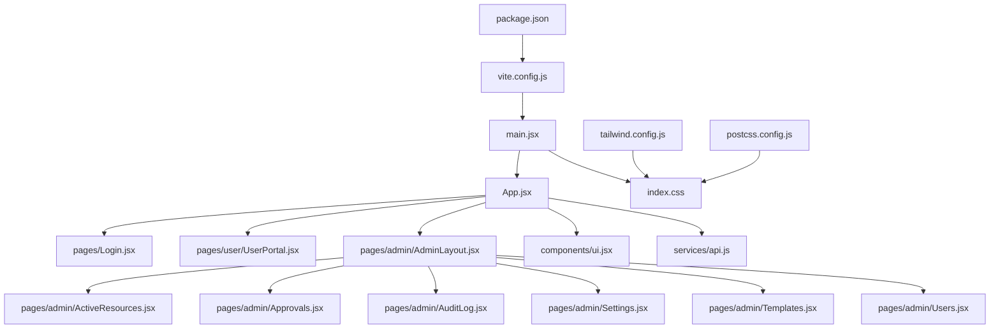
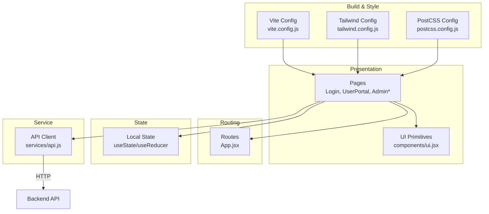
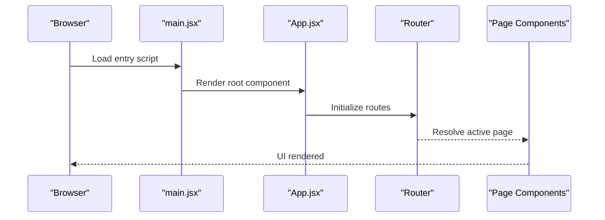
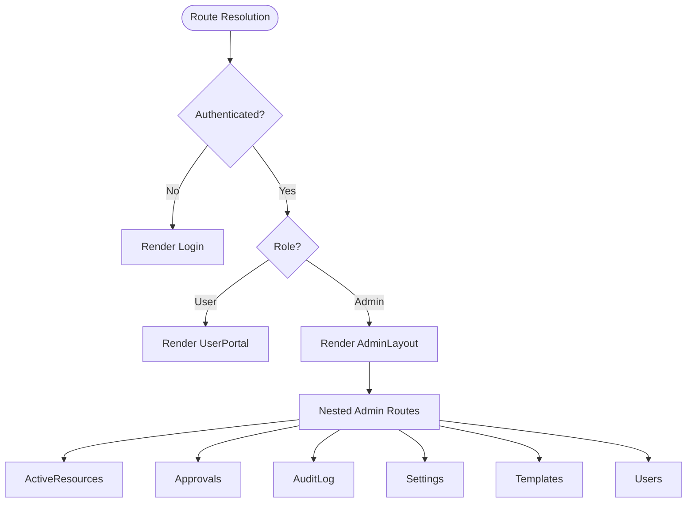
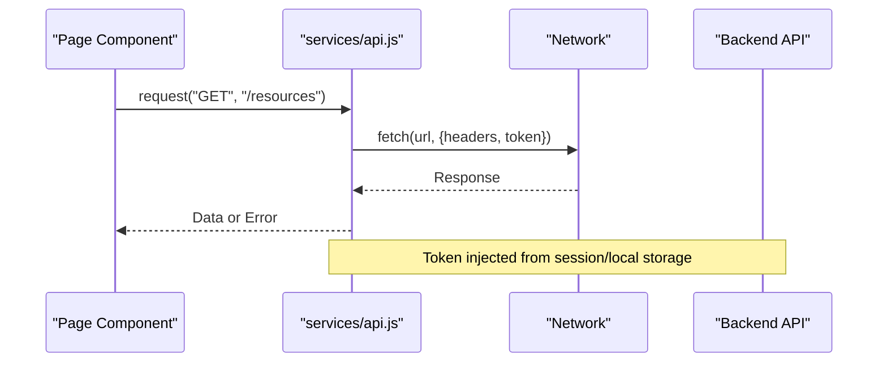
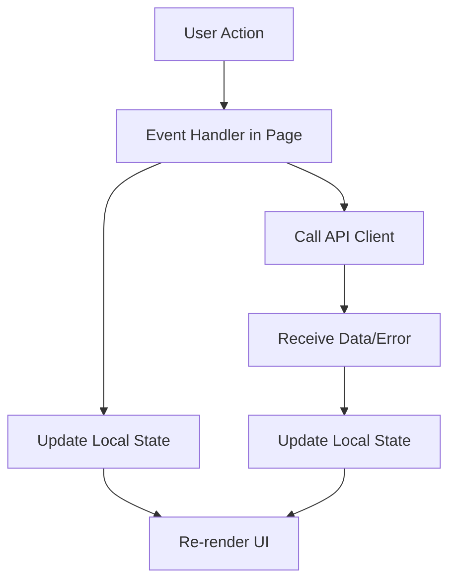
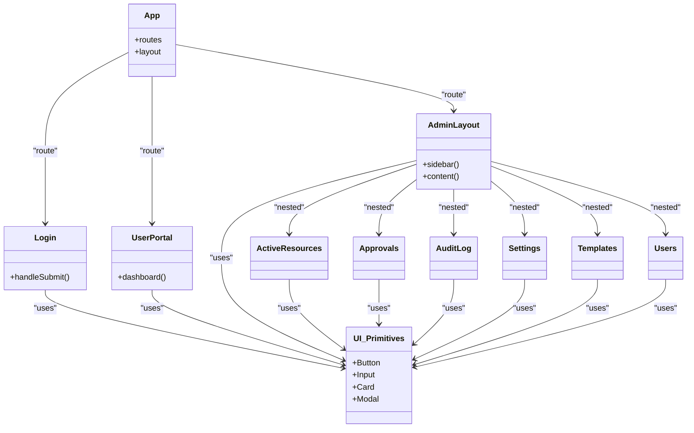
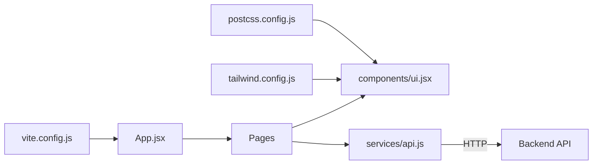

# Frontend Architecture

<cite>
**Referenced Files in This Document**
- [App.jsx](file://frontend/src/App.jsx)
- [main.jsx](file://frontend/src/main.jsx)
- [index.css](file://frontend/src/index.css)
- [ui.jsx](file://frontend/src/components/ui.jsx)
- [Login.jsx](file://frontend/src/pages/Login.jsx)
- [UserPortal.jsx](file://frontend/src/pages/user/UserPortal.jsx)
- [AdminLayout.jsx](file://frontend/src/pages/admin/AdminLayout.jsx)
- [ActiveResources.jsx](file://frontend/src/pages/admin/ActiveResources.jsx)
- [Approvals.jsx](file://frontend/src/pages/admin/Approvals.jsx)
- [AuditLog.jsx](file://frontend/src/pages/admin/AuditLog.jsx)
- [Settings.jsx](file://frontend/src/pages/admin/Settings.jsx)
- [Templates.jsx](file://frontend/src/pages/admin/Templates.jsx)
- [Users.jsx](file://frontend/src/pages/admin/Users.jsx)
- [api.js](file://frontend/src/services/api.js)
- [vite.config.js](file://frontend/vite.config.js)
- [tailwind.config.js](file://frontend/tailwind.config.js)
- [postcss.config.js](file://frontend/postcss.config.js)
- [package.json](file://frontend/package.json)
</cite>

## Table of Contents
1. [Introduction](#introduction)
2. [Project Structure](#project-structure)
3. [Core Components](#core-components)
4. [Architecture Overview](#architecture-overview)
5. [Detailed Component Analysis](#detailed-component-analysis)
6. [Dependency Analysis](#dependency-analysis)
7. [Performance Considerations](#performance-considerations)
8. [Troubleshooting Guide](#troubleshooting-guide)
9. [Conclusion](#conclusion)
10. [Appendices](#appendices)

## Introduction
This document describes the React frontend architecture for the ECS Request System. It explains the component-based design with clear separation between UI components, page components, and service layers; the application bootstrap process; routing structure; state management patterns; API client implementation; data flow; integration with the backend; build configuration using Vite; styling approach with Tailwind CSS; and development workflow. The goal is to provide both a high-level overview and code-level details so that contributors can understand how the application is structured and how to extend it safely.

## Project Structure
The frontend is organized by feature and responsibility:
- Entry points and app shell: main.jsx, App.jsx
- Pages: Login, user portal, admin pages and layout
- Shared UI primitives: components/ui.jsx
- Services: api.js for HTTP requests
- Build and style configuration: vite.config.js, tailwind.config.js, postcss.config.js, package.json
- Global styles: index.css

**Diagram sources**
- [main.jsx](file://frontend/src/main.jsx)
- [App.jsx](file://frontend/src/App.jsx)
- [Login.jsx](file://frontend/src/pages/Login.jsx)
- [UserPortal.jsx](file://frontend/src/pages/user/UserPortal.jsx)
- [AdminLayout.jsx](file://frontend/src/pages/admin/AdminLayout.jsx)
- [ActiveResources.jsx](file://frontend/src/pages/admin/ActiveResources.jsx)
- [Approvals.jsx](file://frontend/src/pages/admin/Approvals.jsx)
- [AuditLog.jsx](file://frontend/src/pages/admin/AuditLog.jsx)
- [Settings.jsx](file://frontend/src/pages/admin/Settings.jsx)
- [Templates.jsx](file://frontend/src/pages/admin/Templates.jsx)
- [Users.jsx](file://frontend/src/pages/admin/Users.jsx)
- [ui.jsx](file://frontend/src/components/ui.jsx)
- [api.js](file://frontend/src/services/api.js)
- [index.css](file://frontend/src/index.css)
- [vite.config.js](file://frontend/vite.config.js)
- [tailwind.config.js](file://frontend/tailwind.config.js)
- [postcss.config.js](file://frontend/postcss.config.js)
- [package.json](file://frontend/package.json)

**Section sources**
- [main.jsx](file://frontend/src/main.jsx)
- [App.jsx](file://frontend/src/App.jsx)
- [index.css](file://frontend/src/index.css)
- [ui.jsx](file://frontend/src/components/ui.jsx)
- [Login.jsx](file://frontend/src/pages/Login.jsx)
- [UserPortal.jsx](file://frontend/src/pages/user/UserPortal.jsx)
- [AdminLayout.jsx](file://frontend/src/pages/admin/AdminLayout.jsx)
- [ActiveResources.jsx](file://frontend/src/pages/admin/ActiveResources.jsx)
- [Approvals.jsx](file://frontend/src/pages/admin/Approvals.jsx)
- [AuditLog.jsx](file://frontend/src/pages/admin/AuditLog.jsx)
- [Settings.jsx](file://frontend/src/pages/admin/Settings.jsx)
- [Templates.jsx](file://frontend/src/pages/admin/Templates.jsx)
- [Users.jsx](file://frontend/src/pages/admin/Users.jsx)
- [api.js](file://frontend/src/services/api.js)
- [vite.config.js](file://frontend/vite.config.js)
- [tailwind.config.js](file://frontend/tailwind.config.js)
- [postcss.config.js](file://frontend/postcss.config.js)
- [package.json](file://frontend/package.json)

## Core Components
- Application shell (App.jsx): Mounts the root layout, sets up routes, and composes top-level providers or wrappers if needed.
- Page components:
  - Login.jsx: Handles authentication entry point and redirects based on auth state.
  - UserPortal.jsx: User-facing dashboard and workflows.
  - AdminLayout.jsx: Admin shell with navigation and nested route rendering.
  - Admin pages: ActiveResources.jsx, Approvals.jsx, AuditLog.jsx, Settings.jsx, Templates.jsx, Users.jsx.
- UI primitives (components/ui.jsx): Reusable building blocks such as buttons, inputs, cards, modals, and layout helpers used across pages.
- Service layer (services/api.js): Centralized HTTP client wrapper around fetch or axios, handling base URL, headers, token injection, error normalization, and typed request/response helpers.

Data binding patterns:
- Props-driven UI: UI components receive data via props and emit events via callbacks.
- Local state: useState/useReducer for ephemeral UI state within components.
- Server state: Lightweight caching and loading/error states managed at the page level or via a small utility around the API client.

API client usage pattern:
- Pages call functions from services/api.js.
- The client attaches authentication tokens and normalizes errors.
- Responses are mapped into domain objects consumed by components.

**Section sources**
- [App.jsx](file://frontend/src/App.jsx)
- [Login.jsx](file://frontend/src/pages/Login.jsx)
- [UserPortal.jsx](file://frontend/src/pages/user/UserPortal.jsx)
- [AdminLayout.jsx](file://frontend/src/pages/admin/AdminLayout.jsx)
- [ActiveResources.jsx](file://frontend/src/pages/admin/ActiveResources.jsx)
- [Approvals.jsx](file://frontend/src/pages/admin/Approvals.jsx)
- [AuditLog.jsx](file://frontend/src/pages/admin/AuditLog.jsx)
- [Settings.jsx](file://frontend/src/pages/admin/Settings.jsx)
- [Templates.jsx](file://frontend/src/pages/admin/Templates.jsx)
- [Users.jsx](file://frontend/src/pages/admin/Users.jsx)
- [ui.jsx](file://frontend/src/components/ui.jsx)
- [api.js](file://frontend/src/services/api.js)

## Architecture Overview
The frontend follows a layered, component-based architecture:
- Presentation layer: Pages and UI components render the interface.
- State layer: Local component state and minimal server-state utilities.
- Service layer: API client encapsulates network calls and error handling.
- Routing layer: Declarative routes map URLs to page components.
- Styling layer: Tailwind CSS with PostCSS and Vite integration.

**Diagram sources**
- [App.jsx](file://frontend/src/App.jsx)
- [Login.jsx](file://frontend/src/pages/Login.jsx)
- [UserPortal.jsx](file://frontend/src/pages/user/UserPortal.jsx)
- [AdminLayout.jsx](file://frontend/src/pages/admin/AdminLayout.jsx)
- [ActiveResources.jsx](file://frontend/src/pages/admin/ActiveResources.jsx)
- [Approvals.jsx](file://frontend/src/pages/admin/Approvals.jsx)
- [AuditLog.jsx](file://frontend/src/pages/admin/AuditLog.jsx)
- [Settings.jsx](file://frontend/src/pages/admin/Settings.jsx)
- [Templates.jsx](file://frontend/src/pages/admin/Templates.jsx)
- [Users.jsx](file://frontend/src/pages/admin/Users.jsx)
- [ui.jsx](file://frontend/src/components/ui.jsx)
- [api.js](file://frontend/src/services/api.js)
- [vite.config.js](file://frontend/vite.config.js)
- [tailwind.config.js](file://frontend/tailwind.config.js)
- [postcss.config.js](file://frontend/postcss.config.js)

## Detailed Component Analysis

### Bootstrap Process
- Entry point mounts the React tree and renders the root component.
- Global styles are imported once at startup.
- The root component initializes routing and any global providers.

**Diagram sources**
- [main.jsx](file://frontend/src/main.jsx)
- [App.jsx](file://frontend/src/App.jsx)

**Section sources**
- [main.jsx](file://frontend/src/main.jsx)
- [App.jsx](file://frontend/src/App.jsx)
- [index.css](file://frontend/src/index.css)

### Routing Structure
- Routes are declared in the application shell and map paths to page components.
- Public routes include login and user portal.
- Protected routes include admin pages grouped under an admin layout.

**Diagram sources**
- [App.jsx](file://frontend/src/App.jsx)
- [Login.jsx](file://frontend/src/pages/Login.jsx)
- [UserPortal.jsx](file://frontend/src/pages/user/UserPortal.jsx)
- [AdminLayout.jsx](file://frontend/src/pages/admin/AdminLayout.jsx)
- [ActiveResources.jsx](file://frontend/src/pages/admin/ActiveResources.jsx)
- [Approvals.jsx](file://frontend/src/pages/admin/Approvals.jsx)
- [AuditLog.jsx](file://frontend/src/pages/admin/AuditLog.jsx)
- [Settings.jsx](file://frontend/src/pages/admin/Settings.jsx)
- [Templates.jsx](file://frontend/src/pages/admin/Templates.jsx)
- [Users.jsx](file://frontend/src/pages/admin/Users.jsx)

**Section sources**
- [App.jsx](file://frontend/src/App.jsx)
- [Login.jsx](file://frontend/src/pages/Login.jsx)
- [UserPortal.jsx](file://frontend/src/pages/user/UserPortal.jsx)
- [AdminLayout.jsx](file://frontend/src/pages/admin/AdminLayout.jsx)
- [ActiveResources.jsx](file://frontend/src/pages/admin/ActiveResources.jsx)
- [Approvals.jsx](file://frontend/src/pages/admin/Approvals.jsx)
- [AuditLog.jsx](file://frontend/src/pages/admin/AuditLog.jsx)
- [Settings.jsx](file://frontend/src/pages/admin/Settings.jsx)
- [Templates.jsx](file://frontend/src/pages/admin/Templates.jsx)
- [Users.jsx](file://frontend/src/pages/admin/Users.jsx)

### API Client Implementation
- Centralized client provides methods for GET, POST, PUT, DELETE.
- Base URL and default headers are configured.
- Authentication token is attached automatically when present.
- Errors are normalized and surfaced consistently to callers.

**Diagram sources**
- [api.js](file://frontend/src/services/api.js)

**Section sources**
- [api.js](file://frontend/src/services/api.js)

### Data Flow Patterns
- One-way data flow: props flow down, events bubble up.
- Local state manages form inputs and transient UI flags.
- Server state is fetched on demand and cached minimally at the page level.
- UI components remain pure and focused on presentation.

[No sources needed since this diagram shows conceptual workflow, not actual code structure]

### Component Hierarchy
Top-down composition from App.jsx to reusable UI components:

**Diagram sources**
- [App.jsx](file://frontend/src/App.jsx)
- [Login.jsx](file://frontend/src/pages/Login.jsx)
- [UserPortal.jsx](file://frontend/src/pages/user/UserPortal.jsx)
- [AdminLayout.jsx](file://frontend/src/pages/admin/AdminLayout.jsx)
- [ActiveResources.jsx](file://frontend/src/pages/admin/ActiveResources.jsx)
- [Approvals.jsx](file://frontend/src/pages/admin/Approvals.jsx)
- [AuditLog.jsx](file://frontend/src/pages/admin/AuditLog.jsx)
- [Settings.jsx](file://frontend/src/pages/admin/Settings.jsx)
- [Templates.jsx](file://frontend/src/pages/admin/Templates.jsx)
- [Users.jsx](file://frontend/src/pages/admin/Users.jsx)
- [ui.jsx](file://frontend/src/components/ui.jsx)

**Section sources**
- [App.jsx](file://frontend/src/App.jsx)
- [Login.jsx](file://frontend/src/pages/Login.jsx)
- [UserPortal.jsx](file://frontend/src/pages/user/UserPortal.jsx)
- [AdminLayout.jsx](file://frontend/src/pages/admin/AdminLayout.jsx)
- [ActiveResources.jsx](file://frontend/src/pages/admin/ActiveResources.jsx)
- [Approvals.jsx](file://frontend/src/pages/admin/Approvals.jsx)
- [AuditLog.jsx](file://frontend/src/pages/admin/AuditLog.jsx)
- [Settings.jsx](file://frontend/src/pages/admin/Settings.jsx)
- [Templates.jsx](file://frontend/src/pages/admin/Templates.jsx)
- [Users.jsx](file://frontend/src/pages/admin/Users.jsx)
- [ui.jsx](file://frontend/src/components/ui.jsx)

### Build Configuration (Vite)
- Development server and hot module replacement are configured via Vite.
- Path aliases and proxy settings can be defined for local development against the backend.
- Production builds optimize assets and code splitting.

Key files:
- vite.config.js: Dev server, proxy, aliases, plugins.
- package.json: Scripts for dev, build, preview.

**Section sources**
- [vite.config.js](file://frontend/vite.config.js)
- [package.json](file://frontend/package.json)

### Styling Approach (Tailwind CSS)
- Tailwind CSS is integrated through PostCSS and Vite.
- Global styles are applied via index.css.
- Utility-first classes compose UI consistently across components.

Key files:
- tailwind.config.js: Theme customization, plugin configuration.
- postcss.config.js: PostCSS pipeline setup.
- index.css: Global imports and base styles.

**Section sources**
- [tailwind.config.js](file://frontend/tailwind.config.js)
- [postcss.config.js](file://frontend/postcss.config.js)
- [index.css](file://frontend/src/index.css)

### Development Workflow
- Install dependencies and start the dev server using npm scripts.
- Hot reload updates components instantly during development.
- Proxy configuration forwards API calls to the backend during local development.
- Build artifacts are generated for production deployment.

Typical commands:
- npm install
- npm run dev
- npm run build
- npm run preview

**Section sources**
- [package.json](file://frontend/package.json)
- [vite.config.js](file://frontend/vite.config.js)

## Dependency Analysis
Internal dependencies:
- Pages depend on UI primitives and the API client.
- AdminLayout composes multiple admin pages.
- App orchestrates routing and layout composition.

External dependencies:
- React and React DOM for rendering.
- Vite for build tooling.
- Tailwind CSS and PostCSS for styling.

**Diagram sources**
- [App.jsx](file://frontend/src/App.jsx)
- [ui.jsx](file://frontend/src/components/ui.jsx)
- [api.js](file://frontend/src/services/api.js)
- [vite.config.js](file://frontend/vite.config.js)
- [tailwind.config.js](file://frontend/tailwind.config.js)
- [postcss.config.js](file://frontend/postcss.config.js)

**Section sources**
- [App.jsx](file://frontend/src/App.jsx)
- [ui.jsx](file://frontend/src/components/ui.jsx)
- [api.js](file://frontend/src/services/api.js)
- [vite.config.js](file://frontend/vite.config.js)
- [tailwind.config.js](file://frontend/tailwind.config.js)
- [postcss.config.js](file://frontend/postcss.config.js)

## Performance Considerations
- Code splitting: Ensure routes are lazy-loaded to reduce initial bundle size.
- Memoization: Use memoization for expensive computations and stable references where appropriate.
- Image and asset optimization: Leverage Vite’s asset handling and consider lazy-loading heavy resources.
- Network efficiency: Batch requests where possible and implement optimistic updates judiciously.
- Styling performance: Prefer Tailwind utilities to avoid large custom CSS bundles.

[No sources needed since this section provides general guidance]

## Troubleshooting Guide
Common issues and resolutions:
- Authentication failures: Verify token presence and expiration handling in the API client.
- CORS errors: Confirm proxy configuration in Vite for local development.
- Missing styles: Ensure Tailwind directives are included in global styles and PostCSS is configured correctly.
- Route not found: Validate route definitions and path parameters.
- Build errors: Check Node version compatibility and dependency versions.

Debugging tips:
- Use browser dev tools to inspect network requests and responses.
- Log API payloads and errors centrally in the service layer.
- Add route guards to verify authentication and authorization flows.

**Section sources**
- [api.js](file://frontend/src/services/api.js)
- [vite.config.js](file://frontend/vite.config.js)
- [postcss.config.js](file://frontend/postcss.config.js)
- [index.css](file://frontend/src/index.css)

## Conclusion
The frontend follows a clean, component-based architecture with clear separation of concerns: pages handle business context, UI primitives encapsulate presentation, and the service layer centralizes API interactions. Vite powers fast development and optimized builds, while Tailwind CSS ensures consistent styling. The routing structure supports public and protected areas, and data flows follow predictable one-way patterns. This foundation enables scalable growth and maintainable evolution of the application.

[No sources needed since this section summarizes without analyzing specific files]

## Appendices

### API Endpoints Integration
- All endpoints are accessed through services/api.js.
- Methods should return normalized data structures and throw standardized errors.
- Example operations: list resources, create requests, approve/reject items, manage users and templates.

[No sources needed since this section provides general guidance]