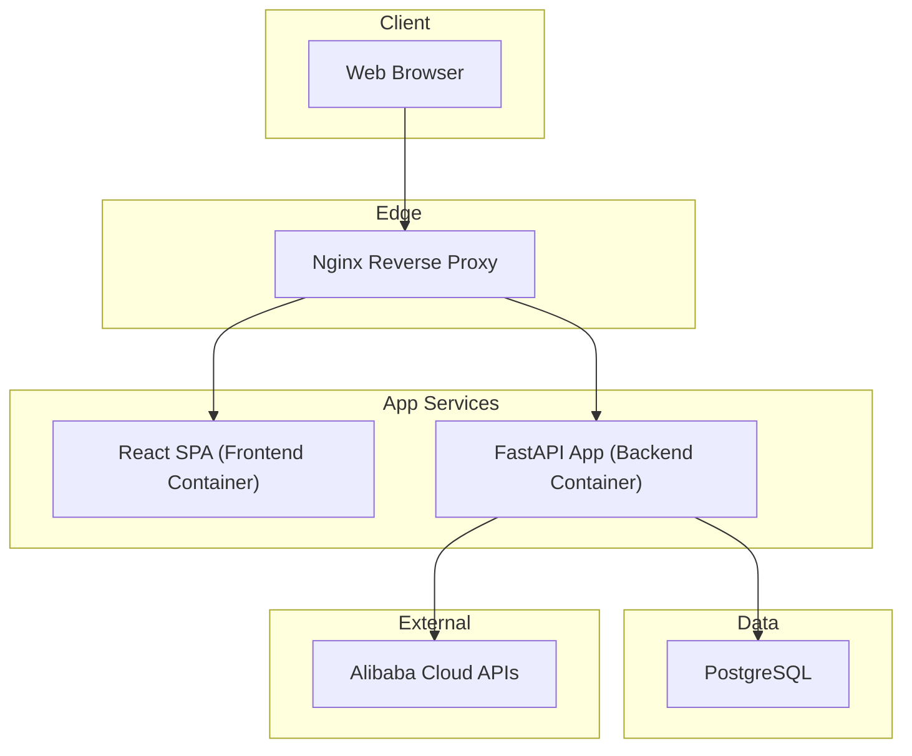
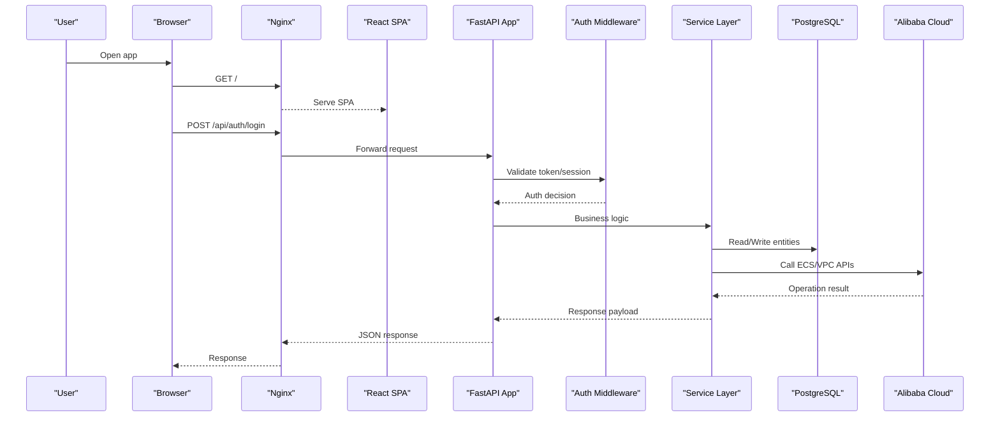
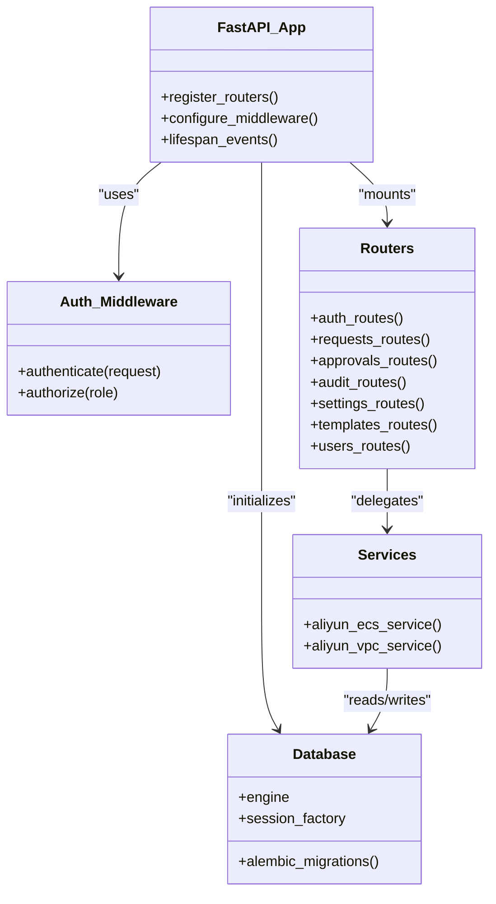
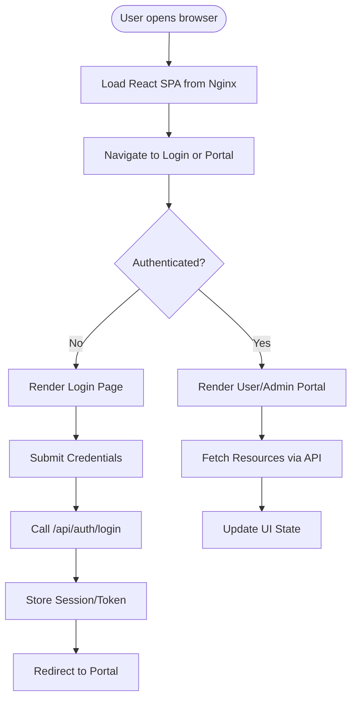
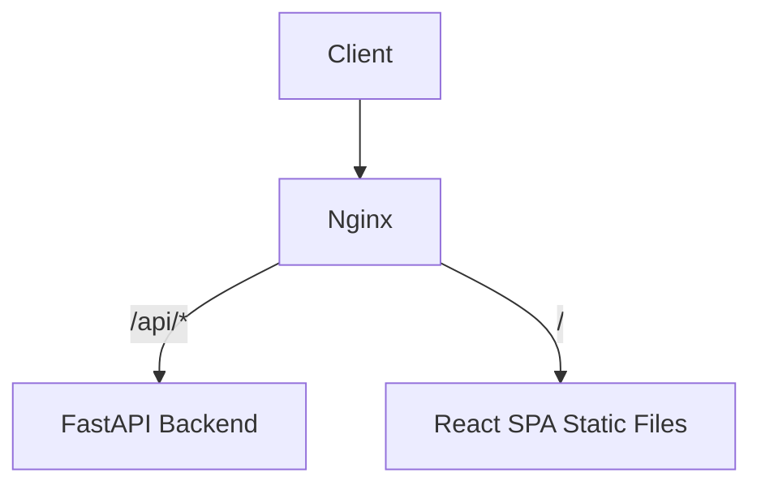
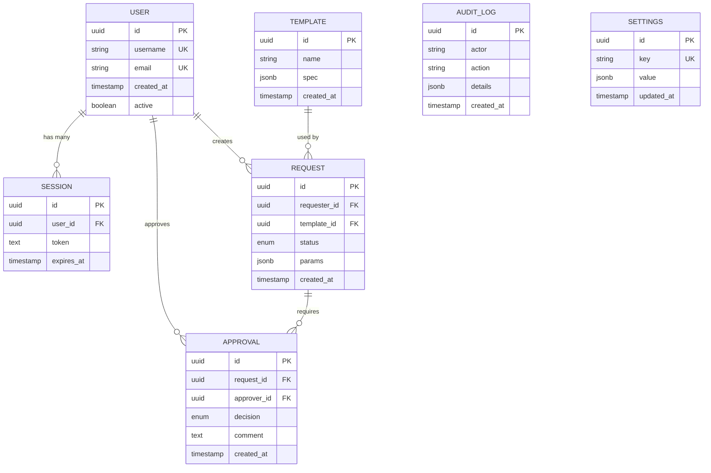
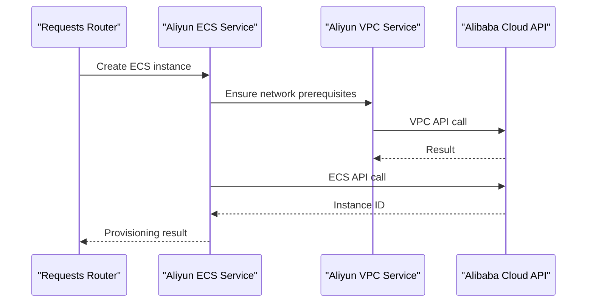
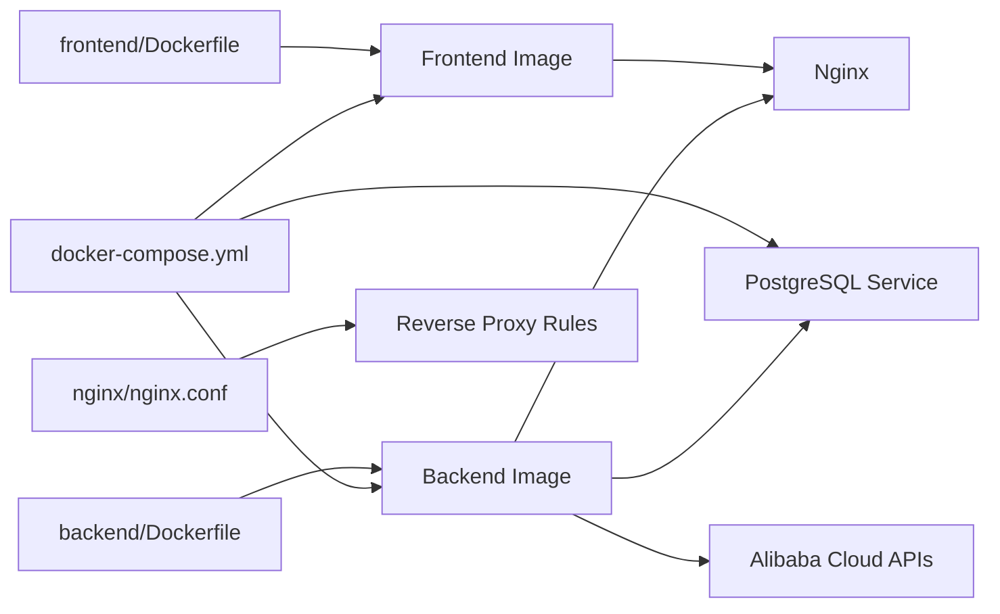
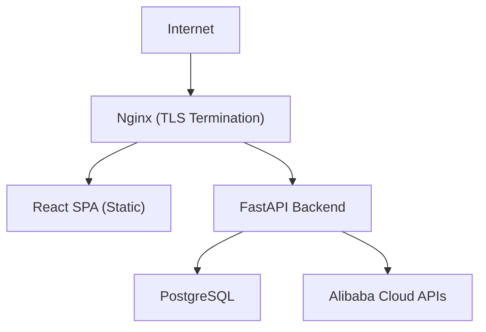

# System Architecture

<cite>
**Referenced Files in This Document**
- [docker-compose.yml](file://docker-compose.yml)
- [README.md](file://README.md)
- [backend/app/main.py](file://backend/app/main.py)
- [backend/app/config.py](file://backend/app/config.py)
- [backend/app/database.py](file://backend/app/database.py)
- [backend/app/middleware/auth.py](file://backend/app/middleware/auth.py)
- [backend/app/routers/auth.py](file://backend/app/routers/auth.py)
- [backend/app/routers/requests.py](file://backend/app/routers/requests.py)
- [backend/app/services/aliyun_ecs.py](file://backend/app/services/aliyun_ecs.py)
- [backend/app/services/aliyun_vpc.py](file://backend/app/services/aliyun_vpc.py)
- [backend/Dockerfile](file://backend/Dockerfile)
- [frontend/src/App.jsx](file://frontend/src/App.jsx)
- [frontend/src/pages/Login.jsx](file://frontend/src/pages/Login.jsx)
- [frontend/src/pages/user/UserPortal.jsx](file://frontend/src/pages/user/UserPortal.jsx)
- [frontend/src/pages/admin/AdminLayout.jsx](file://frontend/src/pages/admin/AdminLayout.jsx)
- [frontend/src/services/api.js](file://frontend/src/services/api.js)
- [frontend/Dockerfile](file://frontend/Dockerfile)
- [nginx/nginx.conf](file://nginx/nginx.conf)
</cite>

## Table of Contents
1. [Introduction](#introduction)
2. [Project Structure](#project-structure)
3. [Core Components](#core-components)
4. [Architecture Overview](#architecture-overview)
5. [Detailed Component Analysis](#detailed-component-analysis)
6. [Dependency Analysis](#dependency-analysis)
7. [Performance Considerations](#performance-considerations)
8. [Security and Cross-Cutting Concerns](#security-and-cross-cutting-concerns)
9. [Monitoring and Observability](#monitoring-and-observability)
10. [Troubleshooting Guide](#troubleshooting-guide)
11. [Conclusion](#conclusion)
12. [Appendices](#appendices)

## Introduction
This document describes the ECS Creator platform architecture, focusing on the separation between the FastAPI backend, React frontend, PostgreSQL database, and Nginx reverse proxy. It explains the containerized microservices design using Docker Compose, component interactions, data flows from user requests through authentication middleware to service layer and external Alibaba Cloud APIs, technology stack decisions, system boundaries, integration patterns, infrastructure requirements, scalability considerations, and deployment topology.

## Project Structure
The repository is organized into clear layers:
- Backend (FastAPI): API endpoints, business logic, services, models, migrations, and configuration.
- Frontend (React + Vite): SPA with admin and user portals, static assets served by Nginx.
- Reverse Proxy (Nginx): TLS termination, routing, and static asset serving.
- Infrastructure: Docker Compose for orchestration, Dockerfiles per service, and environment-driven configuration.

**Diagram sources**
- [docker-compose.yml](file://docker-compose.yml)
- [nginx/nginx.conf](file://nginx/nginx.conf)
- [backend/app/main.py](file://backend/app/main.py)
- [frontend/src/App.jsx](file://frontend/src/App.jsx)

**Section sources**
- [docker-compose.yml](file://docker-compose.yml)
- [README.md](file://README.md)

## Core Components
- FastAPI Backend
  - Entry point and application initialization.
  - Configuration management via environment variables.
  - Database connectivity and migrations.
  - Authentication middleware protecting routes.
  - Service layer integrating with Alibaba Cloud ECS/VPC.
- React Frontend
  - SPA built with Vite and Tailwind CSS.
  - Admin and User portals with role-based views.
  - Centralized API client for HTTP calls.
- Nginx Reverse Proxy
  - Routes /api/* to backend, serves frontend static files.
  - Optional TLS termination and security headers.
- PostgreSQL Database
  - Relational store for users, sessions, templates, requests, approvals, audit logs, settings.
- External Integrations
  - Alibaba Cloud ECS and VPC SDK/APIs invoked from backend services.

**Section sources**
- [backend/app/main.py](file://backend/app/main.py)
- [backend/app/config.py](file://backend/app/config.py)
- [backend/app/database.py](file://backend/app/database.py)
- [backend/app/middleware/auth.py](file://backend/app/middleware/auth.py)
- [backend/app/services/aliyun_ecs.py](file://backend/app/services/aliyun_ecs.py)
- [backend/app/services/aliyun_vpc.py](file://backend/app/services/aliyun_vpc.py)
- [frontend/src/App.jsx](file://frontend/src/App.jsx)
- [frontend/src/services/api.js](file://frontend/src/services/api.js)
- [nginx/nginx.conf](file://nginx/nginx.conf)

## Architecture Overview
High-level flow:
- Client requests hit Nginx, which proxies API calls to the backend and serves the React SPA.
- The backend authenticates requests via middleware, validates schemas, persists state to PostgreSQL, and orchestrates Alibaba Cloud operations via service modules.
- The frontend consumes REST endpoints and renders UI based on responses.

**Diagram sources**
- [nginx/nginx.conf](file://nginx/nginx.conf)
- [backend/app/main.py](file://backend/app/main.py)
- [backend/app/middleware/auth.py](file://backend/app/middleware/auth.py)
- [backend/app/routers/auth.py](file://backend/app/routers/auth.py)
- [backend/app/services/aliyun_ecs.py](file://backend/app/services/aliyun_ecs.py)
- [backend/app/services/aliyun_vpc.py](file://backend/app/services/aliyun_vpc.py)
- [backend/app/database.py](file://backend/app/database.py)

## Detailed Component Analysis

### Backend (FastAPI)
Responsibilities:
- Application bootstrap, dependency injection, lifespan events.
- Route definitions for auth, resources, approvals, audit, settings, templates, users.
- Request/response validation via Pydantic schemas.
- Database access and migrations via Alembic.
- Security middleware for session/token handling.
- Integration services for Alibaba Cloud ECS and VPC.

Key implementation points:
- Application entrypoint registers routers, middleware, and lifespan hooks.
- Configuration is loaded from environment variables for secrets and endpoints.
- Database engine and session factories are initialized centrally.
- Auth middleware enforces authentication and authorization checks before route handlers.
- Service modules encapsulate Alibaba Cloud SDK calls and error mapping.

**Diagram sources**
- [backend/app/main.py](file://backend/app/main.py)
- [backend/app/middleware/auth.py](file://backend/app/middleware/auth.py)
- [backend/app/routers/auth.py](file://backend/app/routers/auth.py)
- [backend/app/routers/requests.py](file://backend/app/routers/requests.py)
- [backend/app/services/aliyun_ecs.py](file://backend/app/services/aliyun_ecs.py)
- [backend/app/services/aliyun_vpc.py](file://backend/app/services/aliyun_vpc.py)
- [backend/app/database.py](file://backend/app/database.py)

**Section sources**
- [backend/app/main.py](file://backend/app/main.py)
- [backend/app/config.py](file://backend/app/config.py)
- [backend/app/database.py](file://backend/app/database.py)
- [backend/app/middleware/auth.py](file://backend/app/middleware/auth.py)
- [backend/app/routers/auth.py](file://backend/app/routers/auth.py)
- [backend/app/routers/requests.py](file://backend/app/routers/requests.py)
- [backend/app/services/aliyun_ecs.py](file://backend/app/services/aliyun_ecs.py)
- [backend/app/services/aliyun_vpc.py](file://backend/app/services/aliyun_vpc.py)

### Frontend (React + Vite)
Responsibilities:
- SPA shell and routing for admin and user portals.
- Login page and protected routes.
- Centralized API client for calling backend endpoints.
- Static build artifacts served by Nginx.

Key implementation points:
- App root initializes routing and layout components.
- Login page handles credentials submission and redirects upon success.
- User portal and admin layouts render feature pages.
- API client abstracts HTTP calls, headers, and base URL.

**Diagram sources**
- [frontend/src/App.jsx](file://frontend/src/App.jsx)
- [frontend/src/pages/Login.jsx](file://frontend/src/pages/Login.jsx)
- [frontend/src/pages/user/UserPortal.jsx](file://frontend/src/pages/user/UserPortal.jsx)
- [frontend/src/pages/admin/AdminLayout.jsx](file://frontend/src/pages/admin/AdminLayout.jsx)
- [frontend/src/services/api.js](file://frontend/src/services/api.js)

**Section sources**
- [frontend/src/App.jsx](file://frontend/src/App.jsx)
- [frontend/src/pages/Login.jsx](file://frontend/src/pages/Login.jsx)
- [frontend/src/pages/user/UserPortal.jsx](file://frontend/src/pages/user/UserPortal.jsx)
- [frontend/src/pages/admin/AdminLayout.jsx](file://frontend/src/pages/admin/AdminLayout.jsx)
- [frontend/src/services/api.js](file://frontend/src/services/api.js)

### Reverse Proxy (Nginx)
Responsibilities:
- Route /api/* to backend service.
- Serve frontend static assets.
- Provide a single ingress point for clients.

Key implementation points:
- Upstream definition for backend service.
- Location blocks for API and static content.
- Optional SSL/TLS termination and security headers.

**Diagram sources**
- [nginx/nginx.conf](file://nginx/nginx.conf)

**Section sources**
- [nginx/nginx.conf](file://nginx/nginx.conf)

### Data Access and Migrations
Responsibilities:
- Database connection pooling and session management.
- Schema migrations via Alembic.
- Models representing core entities.

Key implementation points:
- Engine and session factory configured centrally.
- Alembic env and migration scripts manage schema evolution.
- Models include users, sessions, templates, requests, approvals, audit logs, settings.

**Diagram sources**
- [backend/app/models/request.py](file://backend/app/models/request.py)
- [backend/app/models/session.py](file://backend/app/models/session.py)
- [backend/app/models/template.py](file://backend/app/models/template.py)
- [backend/app/models/user.py](file://backend/app/models/user.py)
- [backend/app/models/audit_log.py](file://backend/app/models/audit_log.py)
- [backend/app/models/settings.py](file://backend/app/models/settings.py)
- [backend/app/schemas/request.py](file://backend/app/schemas/request.py)
- [backend/app/schemas/approval.py](file://backend/app/schemas/approval.py)
- [backend/app/schemas/audit.py](file://backend/app/schemas/audit.py)
- [backend/app/schemas/settings.py](file://backend/app/schemas/settings.py)
- [backend/app/schemas/template.py](file://backend/app/schemas/template.py)
- [backend/app/schemas/user.py](file://backend/app/schemas/user.py)
- [backend/app/database.py](file://backend/app/database.py)

**Section sources**
- [backend/app/database.py](file://backend/app/database.py)
- [backend/app/models/__init__.py](file://backend/app/models/__init__.py)
- [backend/app/models/request.py](file://backend/app/models/request.py)
- [backend/app/models/session.py](file://backend/app/models/session.py)
- [backend/app/models/template.py](file://backend/app/models/template.py)
- [backend/app/models/user.py](file://backend/app/models/user.py)
- [backend/app/models/audit_log.py](file://backend/app/models/audit_log.py)
- [backend/app/models/settings.py](file://backend/app/models/settings.py)
- [backend/app/schemas/__init__.py](file://backend/app/schemas/__init__.py)
- [backend/app/schemas/request.py](file://backend/app/schemas/request.py)
- [backend/app/schemas/approval.py](file://backend/app/schemas/approval.py)
- [backend/app/schemas/audit.py](file://backend/app/schemas/audit.py)
- [backend/app/schemas/settings.py](file://backend/app/schemas/settings.py)
- [backend/app/schemas/template.py](file://backend/app/schemas/template.py)
- [backend/app/schemas/user.py](file://backend/app/schemas/user.py)

### External Integrations (Alibaba Cloud)
Responsibilities:
- Provision and manage ECS instances and VPC resources.
- Map API errors to application-level exceptions.
- Handle retries and timeouts where appropriate.

Integration pattern:
- Service modules wrap Alibaba Cloud SDK calls.
- Routers call services to execute resource lifecycle operations.
- Responses are normalized for consistent client consumption.

**Diagram sources**
- [backend/app/routers/requests.py](file://backend/app/routers/requests.py)
- [backend/app/services/aliyun_ecs.py](file://backend/app/services/aliyun_ecs.py)
- [backend/app/services/aliyun_vpc.py](file://backend/app/services/aliyun_vpc.py)

**Section sources**
- [backend/app/services/aliyun_ecs.py](file://backend/app/services/aliyun_ecs.py)
- [backend/app/services/aliyun_vpc.py](file://backend/app/services/aliyun_vpc.py)
- [backend/app/routers/requests.py](file://backend/app/routers/requests.py)

## Dependency Analysis
Container and runtime dependencies:
- Backend depends on Python packages defined in requirements.txt and uses Dockerfile for packaging.
- Frontend depends on Node toolchain and builds static assets via Vite; Dockerfile produces an image with static files.
- Nginx serves both frontend assets and proxies API traffic.
- PostgreSQL is a separate service managed by Docker Compose.

**Diagram sources**
- [docker-compose.yml](file://docker-compose.yml)
- [backend/Dockerfile](file://backend/Dockerfile)
- [frontend/Dockerfile](file://frontend/Dockerfile)
- [nginx/nginx.conf](file://nginx/nginx.conf)

**Section sources**
- [docker-compose.yml](file://docker-compose.yml)
- [backend/Dockerfile](file://backend/Dockerfile)
- [frontend/Dockerfile](file://frontend/Dockerfile)
- [nginx/nginx.conf](file://nginx/nginx.conf)

## Performance Considerations
- Connection Pooling: Configure database connection pools in the backend to handle concurrent requests efficiently.
- Stateless Backend: Keep backend containers stateless to enable horizontal scaling behind Nginx.
- Caching: Introduce caching for read-heavy endpoints (e.g., templates, settings) to reduce DB load.
- Asynchronous Workflows: Offload long-running provisioning tasks to background workers to keep API latency low.
- Resource Limits: Apply CPU/memory limits per container to prevent noisy neighbor issues.
- CDN: Place a CDN in front of Nginx for global distribution of static assets.

[No sources needed since this section provides general guidance]

## Security and Cross-Cutting Concerns
- Authentication and Authorization:
  - Middleware validates tokens/sessions before route execution.
  - Role-based access control for admin vs user features.
- Secrets Management:
  - Use environment variables for sensitive configuration (DB credentials, cloud keys).
- Input Validation:
  - Pydantic schemas enforce request/response contracts.
- Transport Security:
  - Terminate TLS at Nginx and enforce HTTPS.
- Audit Logging:
  - Persist critical actions to audit log tables for compliance.
- Error Handling:
  - Normalize API errors and avoid leaking internal details to clients.

**Section sources**
- [backend/app/middleware/auth.py](file://backend/app/middleware/auth.py)
- [backend/app/routers/auth.py](file://backend/app/routers/auth.py)
- [backend/app/config.py](file://backend/app/config.py)
- [backend/app/models/audit_log.py](file://backend/app/models/audit_log.py)

## Monitoring and Observability
- Structured Logging: Emit structured logs from backend services for traceability.
- Health Checks: Expose health endpoints for container orchestrators and Nginx upstream checks.
- Metrics: Collect metrics for request latency, error rates, and resource usage.
- Tracing: Propagate correlation IDs across Nginx, backend, and external API calls.
- Alerting: Define alerts for high error rates, slow provisioning, and DB connectivity issues.

[No sources needed since this section provides general guidance]

## Troubleshooting Guide
Common issues and diagnostics:
- Authentication failures:
  - Verify token/session validity and middleware behavior.
- Database connectivity:
  - Check connection strings, credentials, and network reachability.
- Alibaba Cloud API errors:
  - Inspect service-layer error mappings and retry policies.
- Nginx routing:
  - Confirm upstream configuration and location rules.
- Frontend asset loading:
  - Ensure static files are built and mounted correctly.

**Section sources**
- [backend/app/middleware/auth.py](file://backend/app/middleware/auth.py)
- [backend/app/database.py](file://backend/app/database.py)
- [backend/app/services/aliyun_ecs.py](file://backend/app/services/aliyun_ecs.py)
- [backend/app/services/aliyun_vpc.py](file://backend/app/services/aliyun_vpc.py)
- [nginx/nginx.conf](file://nginx/nginx.conf)

## Conclusion
The ECS Creator platform follows a clean separation of concerns with a FastAPI backend, React SPA, PostgreSQL database, and Nginx reverse proxy orchestrated via Docker Compose. The architecture supports secure, scalable, and maintainable operations while integrating with Alibaba Cloud services. By applying the recommended performance, security, monitoring, and troubleshooting practices, the system can reliably provision and manage ECS resources at scale.

[No sources needed since this section summarizes without analyzing specific files]

## Appendices

### Deployment Topology

**Diagram sources**
- [nginx/nginx.conf](file://nginx/nginx.conf)
- [docker-compose.yml](file://docker-compose.yml)

### Infrastructure Requirements
- Compute: Containers for backend, frontend, and Nginx; PostgreSQL service.
- Networking: Internal Docker network for inter-service communication; public ingress via Nginx.
- Storage: Persistent volume for PostgreSQL data.
- Secrets: Environment variables for DB credentials, JWT/session keys, and Alibaba Cloud access keys.
- Scaling: Horizontal scaling for backend replicas behind Nginx; optional read replicas for DB.

**Section sources**
- [docker-compose.yml](file://docker-compose.yml)
- [backend/app/config.py](file://backend/app/config.py)