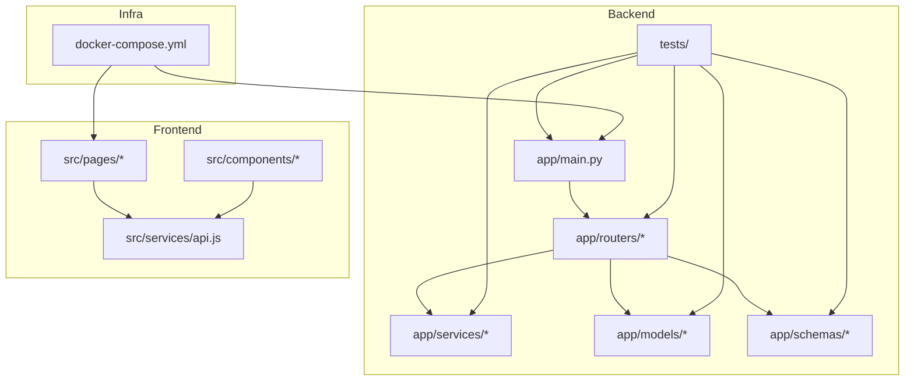
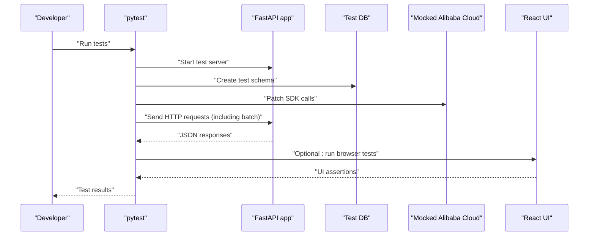
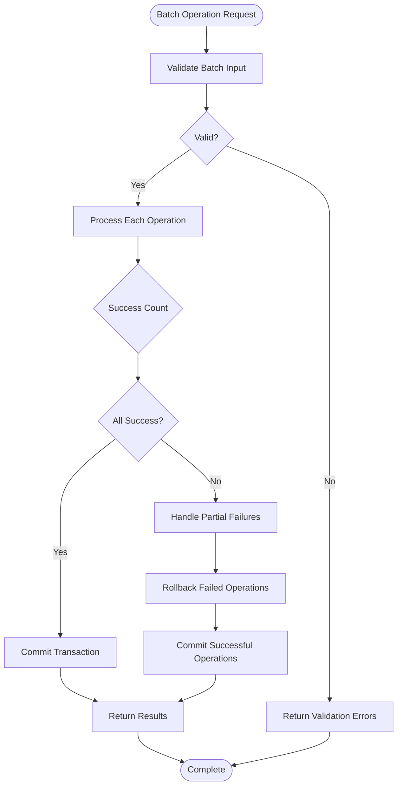
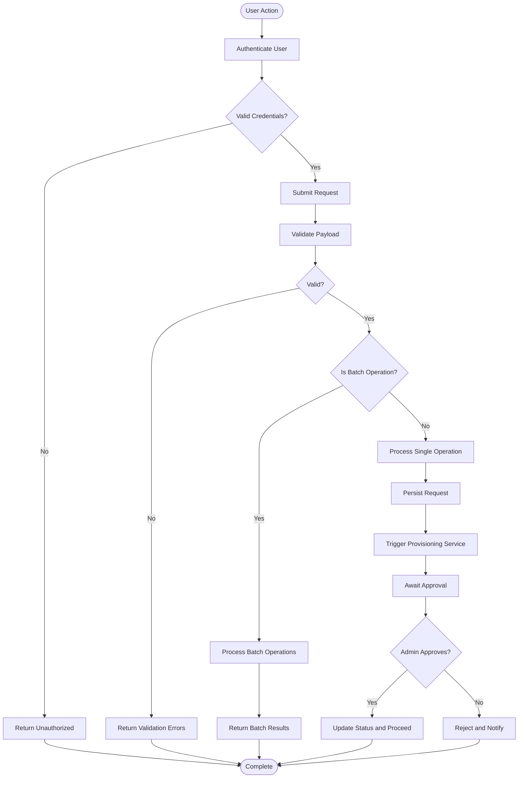
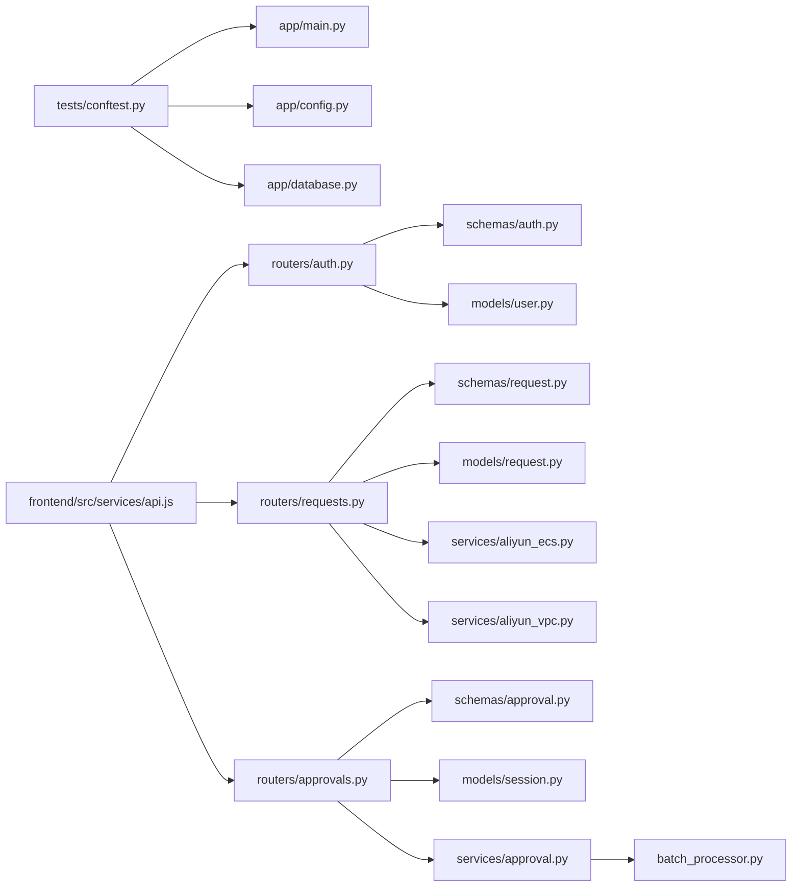

# Testing Strategy

<cite>
**Referenced Files in This Document**
- [backend/tests/conftest.py](file://backend/tests/conftest.py)
- [backend/tests/test_system.py](file://backend/tests/test_system.py)
- [backend/app/main.py](file://backend/app/main.py)
- [backend/app/database.py](file://backend/app/database.py)
- [backend/app/config.py](file://backend/app/config.py)
- [backend/app/routers/auth.py](file://backend/app/routers/auth.py)
- [backend/app/routers/requests.py](file://backend/app/routers/requests.py)
- [backend/app/routers/approvals.py](file://backend/app/routers/approvals.py)
- [backend/app/services/aliyun_ecs.py](file://backend/app/services/aliyun_ecs.py)
- [backend/app/services/aliyun_vpc.py](file://backend/app/services/aliyun_vpc.py)
- [backend/app/services/approval.py](file://backend/app/services/approval.py)
- [backend/app/models/user.py](file://backend/app/models/user.py)
- [backend/app/models/request.py](file://backend/app/models/request.py)
- [backend/app/models/session.py](file://backend/app/models/session.py)
- [backend/app/schemas/auth.py](file://backend/app/schemas/auth.py)
- [backend/app/schemas/request.py](file://backend/app/schemas/request.py)
- [backend/app/schemas/approval.py](file://backend/app/schemas/approval.py)
- [frontend/src/components/ui.jsx](file://frontend/src/components/ui.jsx)
- [frontend/src/pages/Login.jsx](file://frontend/src/pages/Login.jsx)
- [frontend/src/pages/admin/Approvals.jsx](file://frontend/src/pages/admin/Approvals.jsx)
- [frontend/src/pages/user/UserPortal.jsx](file://frontend/src/pages/user/UserPortal.jsx)
- [frontend/src/services/api.js](file://frontend/src/services/api.js)
- [frontend/package.json](file://frontend/package.json)
- [docker-compose.yml](file://docker-compose.yml)
</cite>

## Update Summary
**Changes Made**
- Added comprehensive section on Batch Operation Testing covering successful operations, partial failure handling, input validation, and edge cases
- Updated API Endpoint Tests section to include batch operation endpoints
- Enhanced Business Logic Service Tests with batch processing scenarios
- Added new test case examples for batch workflows
- Updated Critical User Scenarios to include batch operation flows

## Table of Contents
1. [Introduction](#introduction)
2. [Project Structure](#project-structure)
3. [Core Components](#core-components)
4. [Architecture Overview](#architecture-overview)
5. [Detailed Component Analysis](#detailed-component-analysis)
6. [Dependency Analysis](#dependency-analysis)
7. [Performance Considerations](#performance-considerations)
8. [Troubleshooting Guide](#troubleshooting-guide)
9. [Conclusion](#conclusion)
10. [Appendices](#appendices)

## Introduction
This document defines the testing strategy for the ECS Creator platform, covering unit tests, integration tests, and end-to-end (E2E) approaches. It explains how to set up tests using pytest fixtures, mock external dependencies such as Alibaba Cloud APIs, and write effective tests for API endpoints, business logic services, and database operations. It also provides guidance for frontend testing of React components and user workflows, with examples for critical scenarios like authentication flows, resource provisioning, approval workflows, and comprehensive batch operation testing. Finally, it outlines continuous integration setup and automated testing pipelines.

## Project Structure
The repository is organized into backend and frontend layers:
- Backend: FastAPI application with routers, services, models, schemas, and a dedicated tests directory.
- Frontend: React application with pages, components, and an API service layer.
- Infrastructure: Docker Compose configuration for orchestrating services during development and testing.



[No sources needed since this diagram shows conceptual structure]

## Core Components
This section highlights key backend components relevant to testing:
- Application entrypoint and dependency injection patterns used by routers.
- Database initialization and session management.
- Services that interact with Alibaba Cloud APIs (ECS/VPC).
- Routers handling authentication, requests, approvals, and batch operations.
- Schemas and models defining request/response contracts and persistence.

Testing focus areas:
- Unit tests for services and utilities.
- Integration tests for routers against a test database and mocked cloud providers.
- E2E tests validating full user journeys across frontend and backend.
- Comprehensive batch operation testing including success scenarios, partial failures, and edge cases.

**Section sources**
- [backend/app/main.py](file://backend/app/main.py)
- [backend/app/database.py](file://backend/app/database.py)
- [backend/app/services/aliyun_ecs.py](file://backend/app/services/aliyun_ecs.py)
- [backend/app/services/aliyun_vpc.py](file://backend/app/services/aliyun_vpc.py)
- [backend/app/routers/auth.py](file://backend/app/routers/auth.py)
- [backend/app/routers/requests.py](file://backend/app/routers/requests.py)
- [backend/app/routers/approvals.py](file://backend/app/routers/approvals.py)
- [backend/app/models/user.py](file://backend/app/models/user.py)
- [backend/app/models/request.py](file://backend/app/models/request.py)
- [backend/app/models/session.py](file://backend/app/models/session.py)
- [backend/app/schemas/auth.py](file://backend/app/schemas/auth.py)
- [backend/app/schemas/request.py](file://backend/app/schemas/request.py)
- [backend/app/schemas/approval.py](file://backend/app/schemas/approval.py)

## Architecture Overview
The testing architecture spans three layers:
- Unit tests: Validate isolated functions and classes without network or DB calls.
- Integration tests: Exercise routers and services with a real test database and mocked external APIs.
- E2E tests: Run the full stack via Docker Compose and validate user workflows from the UI through the API to the database.



[No sources needed since this diagram shows conceptual workflow]

## Detailed Component Analysis

### Test Setup and Fixtures
- Use pytest fixtures to configure a test database connection, seed data, and client instances.
- Provide a FastAPI test client fixture to exercise routers without starting a production server.
- Centralize environment overrides for secrets and flags to ensure deterministic behavior.

Guidelines:
- Keep fixtures small and composable; prefer overriding specific dependencies rather than recreating entire contexts.
- Use autouse fixtures sparingly; explicitly request fixtures per test case for clarity.
- Ensure fixtures reset state between tests to avoid cross-test pollution.
- Create specialized fixtures for batch operation testing scenarios.

**Section sources**
- [backend/tests/conftest.py](file://backend/tests/conftest.py)
- [backend/app/main.py](file://backend/app/main.py)
- [backend/app/config.py](file://backend/app/config.py)

### Mocking External Dependencies (Alibaba Cloud APIs)
Strategy:
- Patch Alibaba Cloud SDK clients or wrapper methods at import boundaries to return deterministic responses.
- For ECS and VPC services, provide fixtures that replace service instances with test doubles.
- Assert that services call the correct methods with expected parameters.

Best practices:
- Mock only the boundary where external calls occur (e.g., service layer), not internal logic.
- Use parameterized tests to cover success and failure paths (network errors, rate limits, invalid inputs).
- Record representative payloads to validate serialization/deserialization.
- Implement selective mocking for batch operations where some calls succeed while others fail.

**Section sources**
- [backend/app/services/aliyun_ecs.py](file://backend/app/services/aliyun_ecs.py)
- [backend/app/services/aliyun_vpc.py](file://backend/app/services/aliyun_vpc.py)

### API Endpoint Tests
Scope:
- Authentication endpoints: login, token refresh, logout.
- Request lifecycle endpoints: create, list, get, update, cancel.
- Approval endpoints: submit, approve, reject, list pending.
- **Batch operation endpoints**: bulk create, bulk update, bulk delete, mixed operation batches.

Approach:
- Use the test client to send HTTP requests and assert status codes, headers, and JSON bodies.
- Validate schema enforcement by sending malformed payloads and expecting validation errors.
- Verify authorization checks by invoking endpoints with different roles or missing tokens.
- Test batch endpoints with various payload sizes and operation combinations.

Examples:
- Authentication flow: login with valid credentials returns a session/token; invalid credentials return 401.
- Resource provisioning: creating a request triggers service calls; on success, returns created resource ID.
- Approval workflow: submitting an approval transitions state; approving changes status and triggers provisioning.
- **Batch operations**: submit multiple operations in single request; handle partial failures gracefully; return detailed results for each operation.

**Updated** Added comprehensive batch operation endpoint testing including success scenarios, partial failure handling, and input validation.

**Section sources**
- [backend/app/routers/auth.py](file://backend/app/routers/auth.py)
- [backend/app/routers/requests.py](file://backend/app/routers/requests.py)
- [backend/app/routers/approvals.py](file://backend/app/routers/approvals.py)
- [backend/app/schemas/auth.py](file://backend/app/schemas/auth.py)
- [backend/app/schemas/request.py](file://backend/app/schemas/request.py)
- [backend/app/schemas/approval.py](file://backend/app/schemas/approval.py)

### Business Logic Service Tests
Focus:
- Approval service: state transitions, permissions, audit logging.
- Crypto/password utilities: hashing, verification, rotation.
- Settings service: loading defaults, applying overrides.
- **Batch processing service**: transaction management, error handling, rollback strategies, progress tracking.

Approach:
- Instantiate services directly with injected dependencies (e.g., DB sessions, settings).
- Assert side effects such as DB writes, logs, or events.
- Cover edge cases: concurrent approvals, invalid states, missing resources.
- **Test batch scenarios**: successful batch execution, partial failures with rollback, input validation across all items, mixed success/failure outcomes.

**Updated** Enhanced with batch processing service testing covering transaction management, error handling, and rollback strategies.

**Section sources**
- [backend/app/services/approval.py](file://backend/app/services/approval.py)
- [backend/app/services/crypto.py](file://backend/app/services/crypto.py)
- [backend/app/services/password.py](file://backend/app/services/password.py)
- [backend/app/services/settings_service.py](file://backend/app/services/settings_service.py)

### Database Operation Tests
Focus:
- CRUD operations for users, requests, sessions, templates, audit logs.
- Migration execution and rollback safety.
- Query correctness and constraints.
- **Batch database operations**: transaction integrity, constraint validation, bulk insert/update/delete performance.

Approach:
- Use a test database instance initialized before each test suite.
- Seed minimal data via fixtures; assert counts and fields after operations.
- Validate Alembic migrations by running them against the test DB.
- **Test batch transactions**: verify atomicity, consistency, isolation, and durability properties; test rollback scenarios when individual operations fail.

**Updated** Added comprehensive batch database operation testing including transaction integrity and rollback scenarios.

**Section sources**
- [backend/app/database.py](file://backend/app/database.py)
- [backend/app/models/user.py](file://backend/app/models/user.py)
- [backend/app/models/request.py](file://backend/app/models/request.py)
- [backend/app/models/session.py](file://backend/app/models/session.py)

### Frontend Testing Approaches
Scope:
- Unit tests for React components and hooks.
- Integration tests for page-level interactions.
- User workflow tests simulating login, request submission, and approval actions.
- **Batch operation UI testing**: bulk action interfaces, progress indicators, error handling displays, result summaries.

Tools and strategies:
- Use a React testing library to render components and simulate events.
- Mock the API service layer to isolate UI behavior from backend responses.
- For E2E, consider headless browser automation to navigate pages and assert UI states.
- **Test batch UI flows**: bulk selection, confirmation dialogs, progress feedback, error notifications, result summaries.

Examples:
- Login page: submit form with valid credentials; assert redirect and presence of user-specific elements.
- Approvals page: load pending items; click approve; verify toast and updated list.
- User portal: create a new request; confirm success message and navigation.
- **Batch operations UI**: select multiple items; initiate bulk action; display progress; show individual results; handle partial failures with clear messaging.

**Updated** Enhanced with batch operation UI testing covering bulk interfaces, progress indicators, and error handling displays.

**Section sources**
- [frontend/src/pages/Login.jsx](file://frontend/src/pages/Login.jsx)
- [frontend/src/pages/admin/Approvals.jsx](file://frontend/src/pages/admin/Approvals.jsx)
- [frontend/src/pages/user/UserPortal.jsx](file://frontend/src/pages/user/UserPortal.jsx)
- [frontend/src/components/ui.jsx](file://frontend/src/components/ui.jsx)
- [frontend/src/services/api.js](file://frontend/src/services/api.js)
- [frontend/package.json](file://frontend/package.json)

### Batch Operation Testing Framework
**New Section**

Comprehensive testing framework for batch operations covering all critical scenarios:

#### Successful Batch Operations
- Test complete success scenarios where all operations in a batch execute successfully
- Validate response format includes individual operation results
- Verify database state consistency after successful batch completion
- Test performance metrics for large batch sizes

#### Partial Failure Handling
- Test scenarios where some operations succeed while others fail within the same batch
- Validate proper error aggregation and reporting
- Ensure successful operations are committed while failed ones are rolled back appropriately
- Test granular error messages for each failed operation

#### Input Validation
- Test batch size limits and maximum operation counts
- Validate individual item validation within batch context
- Test duplicate detection across batch items
- Verify permission checks for each operation in the batch

#### Edge Cases
- Test empty batch operations
- Test single operation batches (boundary condition)
- Test very large batch sizes for performance and memory usage
- Test concurrent batch operations and race conditions
- Test batch operations with mixed operation types (create, update, delete)



**Diagram sources**
- [backend/app/routers/requests.py](file://backend/app/routers/requests.py)
- [backend/app/services/approval.py](file://backend/app/services/approval.py)

**Section sources**
- [backend/tests/test_system.py](file://backend/tests/test_system.py)
- [backend/app/routers/requests.py](file://backend/app/routers/requests.py)
- [backend/app/services/approval.py](file://backend/app/services/approval.py)

### Critical User Scenarios: Example Test Cases
Authentication Flow
- Given valid credentials, when user logs in, then session/token is returned and protected routes become accessible.
- Given invalid credentials, when user attempts login, then error response is returned and no session is created.

Resource Provisioning
- Given a valid request payload, when user submits a provisioning request, then request is persisted and service calls are initiated.
- Given insufficient permissions, when user submits a request, then access denied response is returned.

Approval Workflow
- Given a pending request, when admin approves, then request status updates and provisioning proceeds.
- Given a pending request, when admin rejects, then request status updates and no provisioning occurs.

**Batch Operation Workflows**
- Given a valid batch of operations, when user submits batch request, then all operations are processed and results are returned.
- Given a batch with some invalid operations, when user submits batch request, then valid operations succeed and invalid ones fail with detailed errors.
- Given a batch with mixed success/failure operations, when batch completes, then successful operations are committed and failed ones are rolled back appropriately.
- Given an empty batch, when user submits batch request, then appropriate validation error is returned.



**Updated** Enhanced with batch operation workflow scenarios and decision points.

[No sources needed since this diagram shows conceptual workflow]

## Dependency Analysis
The following diagram maps core testing dependencies and their relationships:



**Updated** Added batch processor dependency for batch operation functionality.

**Diagram sources**
- [backend/tests/conftest.py](file://backend/tests/conftest.py)
- [backend/app/main.py](file://backend/app/main.py)
- [backend/app/config.py](file://backend/app/config.py)
- [backend/app/database.py](file://backend/app/database.py)
- [backend/app/routers/auth.py](file://backend/app/routers/auth.py)
- [backend/app/routers/requests.py](file://backend/app/routers/requests.py)
- [backend/app/routers/approvals.py](file://backend/app/routers/approvals.py)
- [backend/app/schemas/auth.py](file://backend/app/schemas/auth.py)
- [backend/app/schemas/request.py](file://backend/app/schemas/request.py)
- [backend/app/schemas/approval.py](file://backend/app/schemas/approval.py)
- [backend/app/models/user.py](file://backend/app/models/user.py)
- [backend/app/models/request.py](file://backend/app/models/request.py)
- [backend/app/models/session.py](file://backend/app/models/session.py)
- [backend/app/services/aliyun_ecs.py](file://backend/app/services/aliyun_ecs.py)
- [backend/app/services/aliyun_vpc.py](file://backend/app/services/aliyun_vpc.py)
- [backend/app/services/approval.py](file://backend/app/services/approval.py)
- [frontend/src/services/api.js](file://frontend/src/services/api.js)

**Section sources**
- [backend/tests/conftest.py](file://backend/tests/conftest.py)
- [backend/app/main.py](file://backend/app/main.py)
- [backend/app/config.py](file://backend/app/config.py)
- [backend/app/database.py](file://backend/app/database.py)
- [backend/app/routers/auth.py](file://backend/app/routers/auth.py)
- [backend/app/routers/requests.py](file://backend/app/routers/requests.py)
- [backend/app/routers/approvals.py](file://backend/app/routers/approvals.py)
- [backend/app/schemas/auth.py](file://backend/app/schemas/auth.py)
- [backend/app/schemas/request.py](file://backend/app/schemas/request.py)
- [backend/app/schemas/approval.py](file://backend/app/schemas/approval.py)
- [backend/app/models/user.py](file://backend/app/models/user.py)
- [backend/app/models/request.py](file://backend/app/models/request.py)
- [backend/app/models/session.py](file://backend/app/models/session.py)
- [backend/app/services/aliyun_ecs.py](file://backend/app/services/aliyun_ecs.py)
- [backend/app/services/aliyun_vpc.py](file://backend/app/services/aliyun_vpc.py)
- [backend/app/services/approval.py](file://backend/app/services/approval.py)
- [frontend/src/services/api.js](file://frontend/src/services/api.js)

## Performance Considerations
- Prefer in-memory databases for unit and integration tests to reduce I/O overhead.
- Use lightweight mocks for external APIs to avoid network latency and flakiness.
- Parallelize independent tests where possible; isolate shared state to avoid contention.
- Limit seed data size; generate only what is necessary for each test scenario.
- Profile slow tests and refactor heavy operations into reusable fixtures.
- **Batch operation performance**: Test with varying batch sizes to identify performance bottlenecks; monitor memory usage for large batches; implement timeout controls for long-running batch operations.

**Updated** Added performance considerations specific to batch operations including size limits, memory monitoring, and timeout controls.

[No sources needed since this section provides general guidance]

## Troubleshooting Guide
Common issues and resolutions:
- Flaky network calls: Ensure all Alibaba Cloud SDK calls are patched; verify patch targets match actual imports.
- Database state leakage: Confirm fixtures reset or recreate tables between tests; use transactions or drop/recreate schemas.
- Authentication failures in tests: Validate test client includes proper headers/tokens; check session model expectations.
- Frontend API mismatches: Align frontend service endpoints with router definitions; mock responses consistently.
- **Batch operation issues**: Verify transaction rollback behavior; check error aggregation logic; validate batch size limits; test partial failure scenarios thoroughly.

**Updated** Added troubleshooting guidance for batch operation testing including transaction rollback, error aggregation, and partial failure scenarios.

**Section sources**
- [backend/tests/test_system.py](file://backend/tests/test_system.py)
- [backend/app/routers/auth.py](file://backend/app/routers/auth.py)
- [backend/app/models/session.py](file://backend/app/models/session.py)
- [frontend/src/services/api.js](file://frontend/src/services/api.js)

## Conclusion
A robust testing strategy for the ECS Creator platform combines unit, integration, and E2E tests with careful mocking of external dependencies. By structuring pytest fixtures effectively, isolating services, and validating both API contracts and UI workflows, the team can maintain high confidence in authentication, resource provisioning, approval processes, and comprehensive batch operation functionality. The addition of thorough batch operation testing ensures reliability for bulk operations including success scenarios, partial failure handling, input validation, and edge cases. Continuous integration should execute these tests automatically on every change to catch regressions early.

**Updated** Enhanced conclusion to emphasize the importance of comprehensive batch operation testing alongside existing functionality.

[No sources needed since this section summarizes without analyzing specific files]

## Appendices

### Continuous Integration and Automated Pipelines
- Define CI jobs to:
  - Install backend and frontend dependencies.
  - Run pytest suites with coverage reporting.
  - Build and lint frontend code.
  - Execute E2E tests against a composed stack.
  - **Run batch operation performance tests with various batch sizes**.
- Use Docker Compose to spin up backend, database, and optional services for integration/E2E runs.
- Cache dependencies to speed up builds; store artifacts and reports for review.
- **Implement parallel test execution for batch operation test suites to improve CI performance**.

**Updated** Added specific CI/CD considerations for batch operation testing including performance testing and parallel execution.

**Section sources**
- [docker-compose.yml](file://docker-compose.yml)
- [backend/tests/conftest.py](file://backend/tests/conftest.py)
- [backend/tests/test_system.py](file://backend/tests/test_system.py)
- [frontend/package.json](file://frontend/package.json)

### Batch Operation Testing Examples
**New Section**

#### Example Test Case: Successful Batch Operations
```python
def test_successful_batch_operations(test_client):
    """Test batch operations where all operations succeed"""
    batch_data = {
        "operations": [
            {"type": "create", "resource": "ecs_instance", "config": {...}},
            {"type": "create", "resource": "vpc", "config": {...}},
            {"type": "update", "resource": "dns_record", "config": {...}}
        ]
    }
    
    response = test_client.post("/api/batch", json=batch_data)
    assert response.status_code == 200
    result = response.json()
    assert len(result["results"]) == 3
    assert all(r["status"] == "success" for r in result["results"])
```

#### Example Test Case: Partial Failure Handling
```python
def test_partial_failure_batch_operations(test_client):
    """Test batch operations where some operations fail"""
    batch_data = {
        "operations": [
            {"type": "create", "resource": "ecs_instance", "config": {...}},
            {"type": "create", "resource": "invalid_resource", "config": {...}},
            {"type": "update", "resource": "dns_record", "config": {...}}
        ]
    }
    
    response = test_client.post("/api/batch", json=batch_data)
    assert response.status_code == 200
    result = response.json()
    assert len(result["results"]) == 3
    assert result["results"][0]["status"] == "success"
    assert result["results"][1]["status"] == "failed"
    assert result["results"][2]["status"] == "success"
    assert "error_message" in result["results"][1]
```

#### Example Test Case: Input Validation
```python
def test_batch_input_validation(test_client):
    """Test batch operation input validation"""
    # Empty batch
    empty_batch = {"operations": []}
    response = test_client.post("/api/batch", json=empty_batch)
    assert response.status_code == 400
    
    # Exceeds maximum batch size
    large_batch = {"operations": [{"type": "create", "resource": "test"}] * 1001}
    response = test_client.post("/api/batch", json=large_batch)
    assert response.status_code == 400
    
    # Invalid operation type
    invalid_op = {"operations": [{"type": "invalid_operation", "resource": "test"}]}
    response = test_client.post("/api/batch", json=invalid_op)
    assert response.status_code == 400
```

These examples demonstrate the comprehensive testing approach for batch operations, covering success scenarios, partial failures, and input validation requirements.